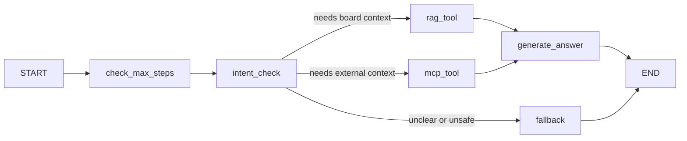

# Agent Design

## Purpose

GlowBoard의 Agent는 사용자의 질문을 보고 RAG tool 또는 MCP tool을 선택해 실행하고, 최종 답변을 만든다. 과제 요구사항상 LangGraph를 사용하고, 상태 관리와 무한 루프 방지 설계가 실제 코드에 남아야 한다.

## Agent Use Case

예시 질문:

- "이 선크림 글이랑 비슷한 논의들을 찾아서 요약해줘."
- "이 topic의 source URL을 확인하고 외부 맥락까지 설명해줘."
- "관련 게시글과 외부 날씨 정보를 참고해서 여름용 추천을 정리해줘."

## Agent State

`AgentState` 후보:

| Field | Type | Purpose |
|---|---|---|
| `question` | string | user input |
| `post_id` | int or null | current topic |
| `steps` | int | executed step count |
| `max_steps` | int | loop guard |
| `intent` | string or null | selected route |
| `tool_calls` | list | executed tools |
| `rag_sources` | list | retrieved post sources |
| `mcp_result` | object or null | external tool result |
| `final_answer` | string or null | final user response |
| `error` | string or null | recoverable error |

## Graph

## Node Responsibilities

| Node | Responsibility |
|---|---|
| `check_max_steps` | stop if `steps >= max_steps` |
| `intent_check` | choose RAG, MCP, direct/fallback |
| `rag_tool` | call RAG service and save sources |
| `mcp_tool` | call MCP client and save result |
| `generate_answer` | combine tool outputs into final answer |
| `fallback` | return safe response when route fails |

## Routing Rules

| Condition | Route |
|---|---|
| question mentions related posts, board, topic, recommendation | `rag_tool` |
| question mentions weather, source URL, external data, metadata | `mcp_tool` |
| no clear tool need | `rag_tool` or `fallback` |
| tool error | `fallback` or answer with partial result |
| max step exceeded | `fallback` |

## SSE Progress Events

The frontend should show the agent trace while running.

| Event | Payload |
|---|---|
| `started` | run_id, question |
| `node` | node name |
| `tool_call` | tool name, args summary |
| `tool_result` | tool name, status |
| `done` | final answer |
| `error` | readable error |

## Implementation Plan

| Step | File | Notes |
|---|---|---|
| State | `backend/app/agents/state.py` | TypedDict or Pydantic |
| Tools | `backend/app/agents/tools.py` | wrap RAG/MCP calls |
| Graph | `backend/app/agents/graph.py` | StateGraph nodes/edges |
| API | `backend/app/routers/agent.py` | `POST /ai/agent` |
| SSE | `backend/app/routers/agent.py` | progress stream |
| Frontend | `frontend/src/pages/AgentPage.tsx` | question/result UI |
| Trace UI | `frontend/src/components/AgentTrace.tsx` | node/tool list |

## Guardrails

- `max_steps` default should be small, for example 3 to 5.
- Do not let the agent call tools indefinitely.
- Tool errors should be recorded in state.
- Final answer should mention partial failure when a tool fails.
- Agent should never require API keys hard-coded in source.

## Completion Criteria

- [ ] LangGraph dependency is installed.
- [ ] `StateGraph` is used in actual code.
- [ ] Graph has named nodes and edges.
- [ ] Agent state tracks steps and tool calls.
- [ ] `max_steps` guard exists.
- [ ] RAG tool wrapper exists.
- [ ] MCP tool wrapper exists.
- [ ] Agent API returns final answer and trace.
- [ ] SSE progress is visible in frontend.
