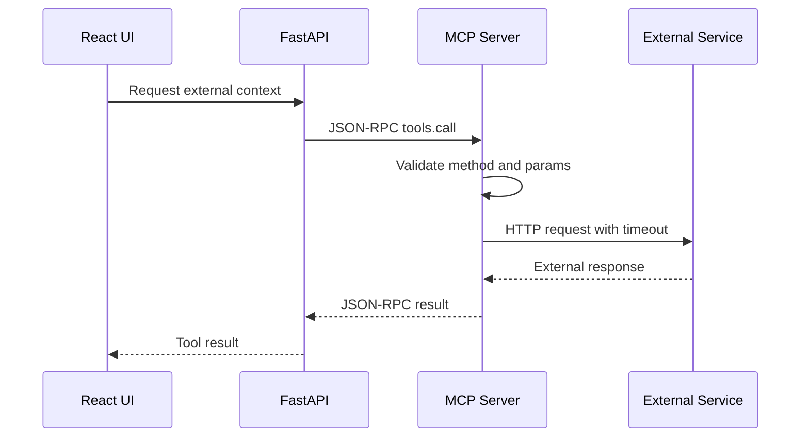

# MCP Design

## Purpose

GlowBoard의 MCP 기능은 backend 또는 Agent가 외부 서비스를 도구처럼 호출할 수 있게 하는 JSON-RPC 기반 server를 구현한다. 과제 요구사항상 최소 1개 이상의 실제 외부 서비스 연동이 필요하다.

## Selected Tool

초기 구현은 API key가 필요 없는 tool을 우선한다.

| Tool | Purpose | External Service |
|---|---|---|
| `get_weather(city)` | beauty/fashion topic의 날씨 맥락 예시 | Open-Meteo |

대체 후보:

- `fetch_url_metadata(url)`: source URL preview를 만든다.
- `fetch_exchange_rate(base, target)`: 글로벌 쇼핑/가격 비교 맥락에 쓴다.

시간이 부족하면 `get_weather(city)`를 먼저 구현하고, `fetch_url_metadata(url)`는 mock 또는 후순위로 둔다.

## JSON-RPC Request/Response

Request:

```json
{
  "jsonrpc": "2.0",
  "id": "req-1",
  "method": "tools.call",
  "params": {
    "name": "get_weather",
    "arguments": {
      "city": "Seoul"
    }
  }
}
```

Success:

```json
{
  "jsonrpc": "2.0",
  "id": "req-1",
  "result": {
    "city": "Seoul",
    "temperature": 23.1,
    "summary": "Clear"
  }
}
```

Error:

```json
{
  "jsonrpc": "2.0",
  "id": "req-1",
  "error": {
    "code": -32602,
    "message": "Invalid params"
  }
}
```

## Flow



## Implementation Plan

| Step | File | Notes |
|---|---|---|
| JSON-RPC models | `mcp_server/main.py` | request/response validation |
| Tool registry | `mcp_server/tools.py` | map tool name to function |
| External call | `mcp_server/tools.py` | timeout/error handling |
| MCP client | `backend/app/services/mcp_client.py` | FastAPI to MCP call |
| API route | `backend/app/routers/ai.py` | tool test endpoint |
| Frontend UI | `frontend/src/pages/McpToolPage.tsx` | input/result/error |

## Error Policy

| Case | Behavior |
|---|---|
| Unknown method | JSON-RPC error `-32601` |
| Invalid params | JSON-RPC error `-32602` |
| External timeout | JSON-RPC server error with readable message |
| External API failure | return recoverable error to UI |
| Missing API key | fail with config error or use keyless tool |

## Security

- API keys must be read from environment variables.
- External URL tools must validate URL scheme.
- Tool calls need timeout.
- Tool result should not be trusted blindly in frontend.
- Do not expose secrets in JSON-RPC result.

## Completion Criteria

- [ ] MCP server accepts JSON-RPC 2.0 request shape.
- [ ] Tool registry exists.
- [ ] At least one real external service is called.
- [ ] FastAPI can call MCP server.
- [ ] Frontend has a small MCP test UI.
- [ ] Errors return JSON-RPC error shape.
- [ ] API keys are not hard-coded.
