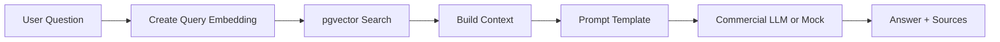

# RAG Design

## Purpose

GlowBoard의 RAG 기능은 게시판 데이터를 근거로 유사 topic 추천과 Q&A 답변을 제공한다. RAG의 핵심은 "답변을 그냥 생성하지 않고, 먼저 게시판 데이터를 검색한 뒤 그 결과를 근거로 답변한다"는 점이다.

## User Features

- Topic detail에서 유사 topic Top 3 표시
- 사용자가 질문하면 관련 topic/comment를 검색한 뒤 답변
- 답변에 source post를 함께 표시
- LLM/API key가 없을 때 mock answer로 flow 유지

## Data Sources

| Source | Use |
|---|---|
| `posts.title` | retrieval query와 source title |
| `posts.body` | answer context |
| `comments.body` | discussion context |
| `tags.name` | retrieval hint |
| `posts.board` | category filter |
| `post_embeddings.embedding` | similarity search |

## Flow



## Implementation Plan

| Step | File | Notes |
|---|---|---|
| Embedding wrapper | `backend/app/services/embedding_client.py` | env, timeout, mock fallback |
| Vector search | `backend/app/services/vector_search_service.py` | pgvector SQL |
| Context builder | `backend/app/services/rag_service.py` | pure function preferred |
| LLM wrapper | `backend/app/services/llm_client.py` | no hard-coded key |
| API schema | `backend/app/schemas/ai.py` | question, answer, sources |
| API route | `backend/app/routers/ai.py` | `POST /ai/rag-answer` |
| Frontend | `frontend/src/pages/AiQuestionPage.tsx` | loading/error/source UI |

## Prompt Requirements

The prompt should include:

- User question
- Retrieved post snippets
- Retrieved comment snippets where available
- Instruction to answer only from given context when possible
- Instruction to return source IDs or titles
- Fallback message when context is weak

## Response Shape

```json
{
  "answer": "Short answer based on GlowBoard data",
  "sources": [
    {
      "post_id": 1,
      "title": "Best lightweight sunscreen",
      "score": 0.84
    }
  ],
  "used_mock": false
}
```

## Reliability

- Embedding and LLM calls need timeout.
- LLM call should retry only a small number of times.
- Repeated LLM failures should return a friendly fallback.
- Cache repeated question/context pairs in Redis if time allows.
- RAG answer must not hide missing context.

## Completion Criteria

- [ ] Posts are embedded and stored in pgvector.
- [ ] Similar posts API works.
- [ ] RAG answer API retrieves board data before answering.
- [ ] Answer includes sources.
- [ ] Mock fallback works without API key.
- [ ] RAG design is referenced from README.
