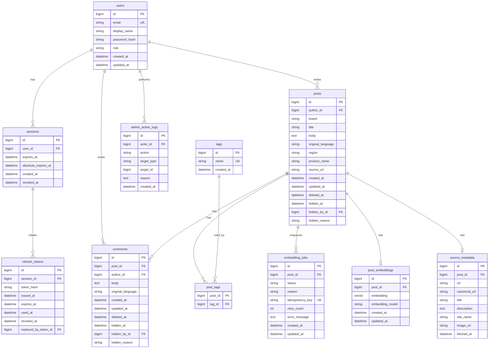

# Database ERD

## Purpose

이 문서는 GlowBoard의 relational schema와 pgvector 저장 구조를 설명한다. 실제 DB 구조는 Alembic migration이 기준이고, 이 문서는 사람이 이해하기 위한 지도 역할을 한다.

주요 설계 결정은 `docs/architecture/design-decisions.md`를 보고, 기능별 파일/API/DB 지도는 `docs/architecture/feature-implementation-map.md`를 본다.
Auth/session 상세 정책은 `docs/architecture/auth-session-design.md`를 따른다.

## 작성 방법

ERD를 그릴 때는 기능에서 명사를 먼저 찾는다.

- user: 가입하고 글과 댓글을 작성한다.
- session: 특정 기기/브라우저의 로그인 상태를 기록한다.
- refresh_token: 한 session 안에서 발급된 refresh token rotation 이력을 기록한다.
- post: 게시판 topic이다.
- comment: topic 아래 토론이다.
- tag: topic discovery와 filter에 쓰인다.
- post_tag: post와 tag의 N:M 연결이다.
- embedding_job: worker가 처리할 embedding 작업이다.
- post_embedding: post의 vector representation이다.
- source_metadata: MCP가 가져온 외부 URL metadata다.

## Initial ERD



## Relationship Notes

| Relationship | Type | Why |
|---|---|---|
| `users -> posts` | 1:N | 한 사용자는 여러 topic을 작성할 수 있다. |
| `users -> comments` | 1:N | 한 사용자는 여러 댓글을 작성할 수 있다. |
| `users -> sessions` | 1:N | 같은 계정은 여러 기기/브라우저에서 로그인할 수 있다. |
| `users -> admin_action_logs` | 1:N | admin 사용자는 여러 moderation action을 수행할 수 있다. |
| `sessions -> refresh_tokens` | 1:N | 한 로그인 session 안에서 refresh token이 rotation되며 이력이 쌓인다. |
| `posts -> comments` | 1:N | 한 topic에는 여러 댓글이 달린다. |
| `posts <-> tags` | N:M | 한 topic에는 여러 tag가 있고, 한 tag는 여러 topic에 쓰인다. |
| `posts -> post_embeddings` | 1:0..1 | 한 topic의 현재 embedding은 하나만 유지한다. |
| `posts -> embedding_jobs` | 1:N | 수정할 때마다 embedding job이 새로 생길 수 있다. |
| `posts -> source_metadata` | 1:0..1 | source URL이 있을 때 MCP metadata를 저장한다. |

## Normalization Notes

- Tag 이름은 `tags` table에 한 번만 저장한다.
- Post와 tag의 연결은 `post_tags` table에 저장한다.
- User email은 unique여야 한다.
- Post 본문과 embedding vector는 분리한다.
- Source metadata는 외부 호출 결과이므로 post 기본 필드와 분리한다.

## Index Plan

| Table | Index | Purpose |
|---|---|---|
| `users` | unique `email` | login lookup |
| `sessions` | `user_id` | user session lookup |
| `sessions` | `expires_at`, `absolute_expires_at`, `revoked_at` | active session filtering |
| `refresh_tokens` | `session_id` | refresh history lookup |
| `refresh_tokens` | unique/index `token_hash` or lookup id | refresh token verification |
| `posts` | `author_id` | owner posts lookup |
| `posts` | `created_at` | list sorting |
| `posts` | `board` | board filter |
| `posts` | title/body search index | keyword search |
| `comments` | `post_id` | comment list |
| `post_tags` | composite `post_id`, `tag_id` | duplicate prevention |
| `tags` | unique `name` | tag reuse |
| `embedding_jobs` | unique `idempotency_key` | duplicate job prevention |
| `post_embeddings` | unique `post_id` | one current embedding per post |
| `post_embeddings` | vector index | similarity search |

## Migration Checklist

- [ ] Every table has a primary key.
- [ ] Every relationship has a foreign key.
- [ ] N:M relationships use a join table.
- [ ] Search/filter columns have indexes.
- [ ] `vector` extension is enabled before vector columns.
- [ ] Unique constraints match service logic.
- [ ] Migration file names clearly describe the change.


## Day 1 MVP ERD

Day 1에서는 게시판 MVP에 필요한 `users`, `sessions`, `posts`만 먼저 구현한다.
댓글, 태그, embedding, source metadata는 Day 2 이후에 확장한다.

```text
users
- id: PK
- email: unique
- display_name: string
- password_hash: string
- created_at: datetime

sessions
- id: PK
- user_id: FK -> users.id
- expires_at: datetime
- absolute_expires_at: datetime
- created_at: datetime
- revoked_at: datetime, nullable

refresh_tokens
- id: PK
- session_id: FK -> sessions.id
- token_hash: string
- issued_at: datetime
- expires_at: datetime
- used_at: datetime, nullable
- revoked_at: datetime, nullable
- replaced_by_token_id: FK -> refresh_tokens.id, nullable

posts
- id: PK
- author_id: FK -> users.id
- title: string
- body: text
- created_at: datetime
- updated_at: datetime

users 1 ---- N sessions
sessions 1 ---- N refresh_tokens
users 1 ---- N posts
posts.author_id -> users.id
sessions.user_id -> users.id
refresh_tokens.session_id -> sessions.id
```

## Day 2 ERD Extension

Day 2에서는 Day 1의 `users`, `sessions`, `posts` 위에 댓글과 태그 관계를 추가한다.

### Decisions

- 댓글 삭제 정책은 soft delete로 한다.
- 태그 저장 구조는 `tags + post_tags`로 한다.
- 게시글과 댓글은 1:N 관계다.
- 게시글과 태그는 N:M 관계다.
- N:M 관계는 `post_tags` join table로 연결한다.
- 게시글 목록 검색은 `ILIKE + offset pagination`으로 시작한다.
- 댓글 작성 rate limit은 Redis에서 `rate:comments:create:{user_id}` key로 관리한다.
- refresh session은 7일 idle timeout과 30일 absolute max를 함께 둔다.
- `sessions.expires_at`은 idle 만료, `sessions.absolute_expires_at`은 최대 만료, `sessions.revoked_at`은 명시적 폐기 시각을 뜻한다.
- refresh token rotation 이력은 `refresh_tokens` table에 남긴다.
- `refresh_tokens.used_at`이 이미 있는 token이 다시 들어오면 재사용으로 보고 parent session을 revoke한다.

### Tables

```text
comments
- id: PK
- post_id: FK -> posts.id
- author_id: FK -> users.id
- body: text
- created_at: datetime
- updated_at: datetime
- deleted_at: datetime, nullable

tags
- id: PK
- normalized_name: unique string
- display_name: string
- created_at: datetime

post_tags
- post_id: FK -> posts.id
- tag_id: FK -> tags.id
- primary key: post_id + tag_id

refresh_tokens
- id: PK
- session_id: FK -> sessions.id
- token_hash: string
- issued_at: datetime
- expires_at: datetime
- used_at: datetime, nullable
- revoked_at: datetime, nullable
- replaced_by_token_id: FK -> refresh_tokens.id, nullable
```

### Relationships

```text
users 1 ---- N comments
posts 1 ---- N comments
posts N ---- M tags through post_tags

comments.author_id -> users.id
comments.post_id -> posts.id
post_tags.post_id -> posts.id
post_tags.tag_id -> tags.id
```

### Indexes and Constraints

- `comments.post_id`는 게시글 상세의 댓글 목록 조회를 위해 index를 둔다.
- `comments.author_id`는 작성자 권한 확인과 사용자별 댓글 조회를 위해 index 후보로 둔다.
- `comments.deleted_at`은 soft delete 목록 제외 조건에 사용한다.
- `tags.normalized_name`은 중복 태그 생성을 막기 위해 unique로 둔다.
- `post_tags(post_id, tag_id)`는 같은 글에 같은 태그가 두 번 붙지 않도록 composite primary key 또는 unique constraint로 둔다.
- `posts.created_at`은 최신순 목록과 offset pagination에 사용한다.
- `posts.title`, `posts.body`는 Day 2 `ILIKE` 검색 대상이다. full-text search index는 개선 후보로 남긴다.

### Soft Delete Policy

- Day 2 댓글은 soft delete로 시작하므로 `comments.deleted_at`을 둔다.
- `DELETE /api/comments/{comment_id}`는 row를 실제로 삭제하지 않고 `deleted_at`에 현재 시각을 기록한다.
- `GET /api/posts/{post_id}/comments`는 `deleted_at IS NULL`인 댓글만 반환한다.
- audit log, 삭제된 댓글 표시 문구, 관리자 복구 UI는 개선 후보로 남긴다.

### Tag Normalization Policy

- 사용자가 입력한 태그는 앞뒤 공백을 제거한다.
- 중복 판단은 `normalized_name` 기준으로 한다.
- `normalized_name`은 lowercase 기준으로 시작한다.
- 화면에는 `display_name`을 보여준다.
- 예: `"Sunscreen"`, `" sunscreen "`, `"SUNSCREEN"`은 같은 `normalized_name = "sunscreen"`으로 본다.

### Day 2 Migration Checklist

- [ ] `comments` table을 추가한다.
- [ ] `comments.post_id`, `comments.author_id` foreign key를 추가한다.
- [ ] `comments.deleted_at` nullable column을 추가한다.
- [ ] `tags` table을 추가한다.
- [ ] `tags.normalized_name` unique constraint를 추가한다.
- [ ] `post_tags` join table을 추가한다.
- [ ] `post_tags(post_id, tag_id)` composite primary key 또는 unique constraint를 추가한다.
- [ ] 댓글 목록, 태그 필터, 최신순 pagination에 필요한 index를 반영한다.

## Day 3 ERD Extension

Day 3 added admin authorization, admin soft hide/restore for posts and comments, author post soft delete, MyPage activity queries, and compact audit logging.

### Implemented: Admin Role Guard

```text
users
- role: string, default "user", not null
```

Policy:

- `users.role = "user"` is the default for new signups.
- `users.role = "admin"` is required for admin-only backend routes.
- Current implemented admin smoke endpoint: `GET /api/admin/health`.

Migration note:

- Tests create a fresh SQLite schema, so `users.role` exists there automatically.
- Existing PostgreSQL development DB tables are not altered by SQLAlchemy `create_all`.
- Before manual Swagger/browser admin checks against the existing PostgreSQL DB, add the `users.role` column or run the future migration.

### Implemented: Admin Moderation

```text
posts
- deleted_at: datetime, nullable
- hidden_at: datetime, nullable
- hidden_by_id: FK -> users.id, nullable
- hidden_reason: string/text, nullable

comments
- hidden_at: datetime, nullable
- hidden_by_id: FK -> users.id, nullable
- hidden_reason: string/text, nullable

admin_action_logs
- id: PK
- actor_id: FK -> users.id
- action: string
- target_type: string
- target_id: integer
- reason: string/text, nullable
- created_at: datetime
```

Policy target:

- Author post deletion uses `posts.deleted_at`; row is preserved.
- Public post list/detail should exclude posts where `deleted_at IS NOT NULL`.
- Public post list/detail should exclude posts where `hidden_at IS NOT NULL`.
- Public comment list and comment update/delete lookup should exclude comments where `hidden_at IS NOT NULL`.
- Admin post/comment list endpoints include visible and admin-hidden rows but exclude author-deleted content.
- Author comment deletion still uses `comments.deleted_at`; admin hide uses `comments.hidden_at`.
- Future vector search/RAG should exclude hidden posts and hidden comments from retrieval sources.
- Admin hide/restore creates a compact audit log row without storing raw content snapshots.

Development DB update applied on 2026-06-16:

```text
users.role
posts.deleted_at
posts.hidden_at / hidden_by_id / hidden_reason
comments.hidden_at / hidden_by_id / hidden_reason
admin_action_logs
```
