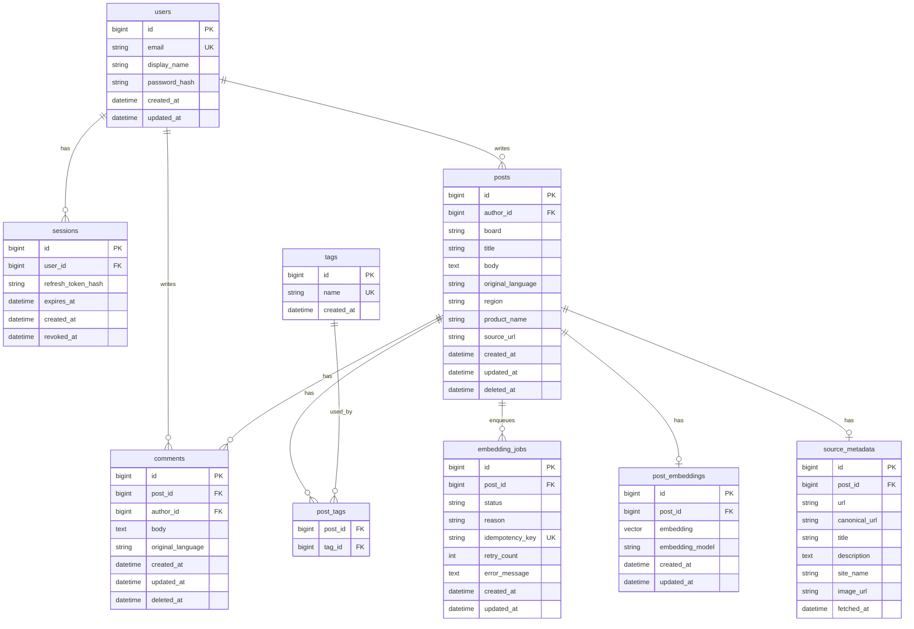

# Database ERD

## Purpose

이 문서는 GlowBoard의 relational schema와 pgvector 저장 구조를 설명한다. 실제 DB 구조는 Alembic migration이 기준이고, 이 문서는 사람이 이해하기 위한 지도 역할을 한다.

## 작성 방법

ERD를 그릴 때는 기능에서 명사를 먼저 찾는다.

- user: 가입하고 글과 댓글을 작성한다.
- session: 로그인 상태나 refresh/session 관리를 기록한다.
- post: 게시판 topic이다.
- comment: topic 아래 토론이다.
- tag: topic discovery와 filter에 쓰인다.
- post_tag: post와 tag의 N:M 연결이다.
- embedding_job: worker가 처리할 embedding 작업이다.
- post_embedding: post의 vector representation이다.
- source_metadata: MCP가 가져온 외부 URL metadata다.

## Initial ERD

## Relationship Notes

| Relationship | Type | Why |
|---|---|---|
| `users -> posts` | 1:N | 한 사용자는 여러 topic을 작성할 수 있다. |
| `users -> comments` | 1:N | 한 사용자는 여러 댓글을 작성할 수 있다. |
| `posts -> comments` | 1:N | 한 topic에는 여러 댓글이 달린다. |
| `posts <-> tags` | N:M | 한 topic에는 여러 tag가 있고, 한 tag는 여러 topic에 쓰인다. |
| `posts -> post_embeddings` | 1:0..1 | 한 topic의 현재 embedding은 하나만 유지한다. |
| `posts -> embedding_jobs` | 1:N | 수정할 때마다 embedding job이 새로 생길 수 있다. |
| `posts -> source_metadata` | 1:0..1 | source URL이 있을 때 MCP metadata를 저장한다. |

## Normalization Notes

- Tag 이름은 `tags` table에 한 번만 저장한다.
- Post와 tag의 연결은 `post_tags` table에 저장한다.
- User email은 unique여야 한다.
- Post 본문과 embedding vector는 분리한다.
- Source metadata는 외부 호출 결과이므로 post 기본 필드와 분리한다.

## Index Plan

| Table | Index | Purpose |
|---|---|---|
| `users` | unique `email` | login lookup |
| `posts` | `author_id` | owner posts lookup |
| `posts` | `created_at` | list sorting |
| `posts` | `board` | board filter |
| `posts` | title/body search index | keyword search |
| `comments` | `post_id` | comment list |
| `post_tags` | composite `post_id`, `tag_id` | duplicate prevention |
| `tags` | unique `name` | tag reuse |
| `embedding_jobs` | unique `idempotency_key` | duplicate job prevention |
| `post_embeddings` | unique `post_id` | one current embedding per post |
| `post_embeddings` | vector index | similarity search |

## Migration Checklist

- [ ] Every table has a primary key.
- [ ] Every relationship has a foreign key.
- [ ] N:M relationships use a join table.
- [ ] Search/filter columns have indexes.
- [ ] `vector` extension is enabled before vector columns.
- [ ] Unique constraints match service logic.
- [ ] Migration file names clearly describe the change.
