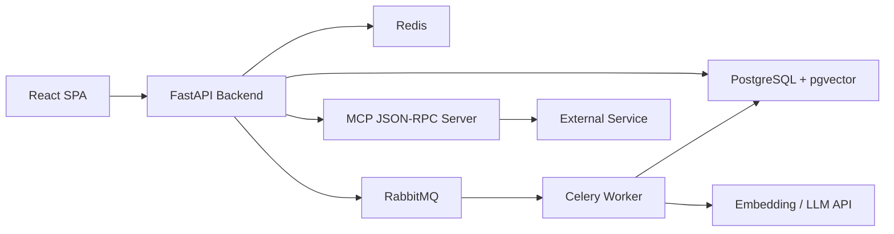
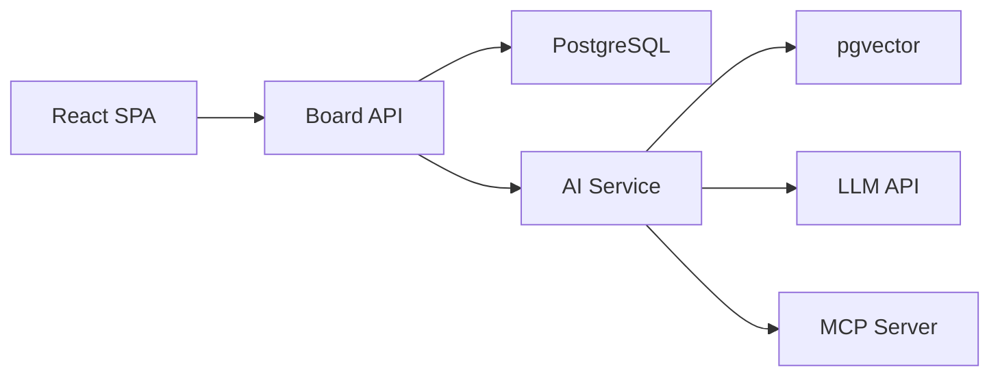
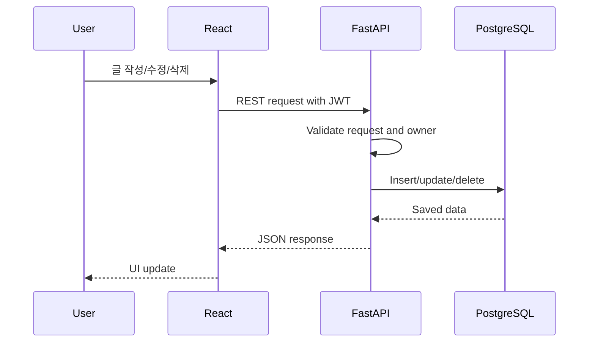
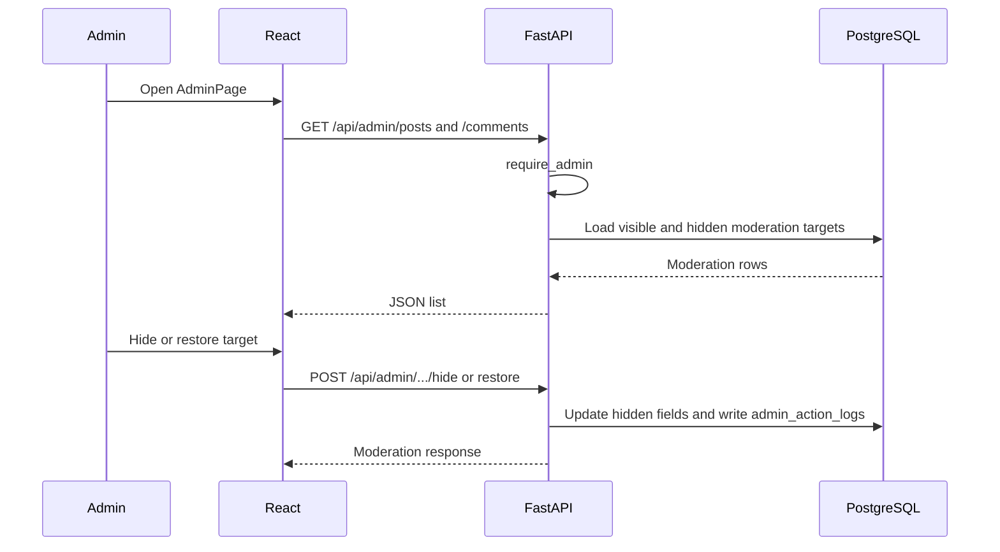
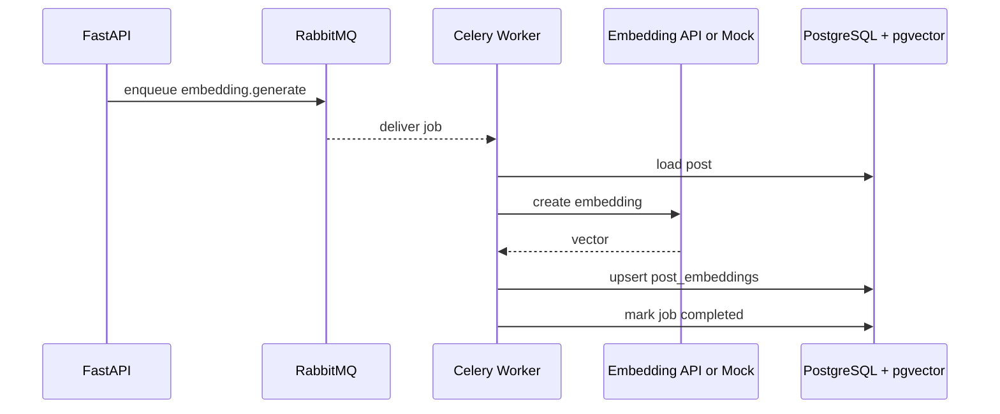
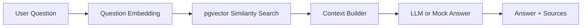
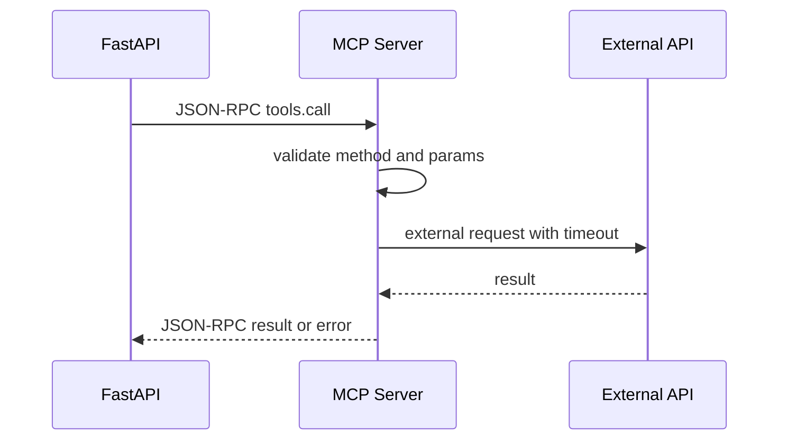
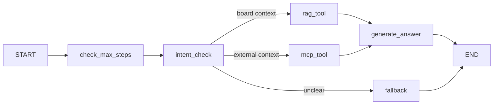

# System Architecture

## 이 문서의 목적

이 문서는 GlowBoard의 전체 구조를 처음부터 확정하기 위한 문서가 아니다.

목적은 아래 세 가지다.

1. 어떤 구조 후보가 있는지 비교한다.
2. 과제 요구사항 때문에 반드시 들어가야 하는 선택과 우리가 선택할 수 있는 부분을 구분한다.
3. 구현을 진행하면서 실제 코드와 맞게 결정을 업데이트한다.

현재까지 확정한 세부 설계 결정은 `docs/architecture/design-decisions.md`에 모아 둔다.
Auth/session 상세 설계는 `docs/architecture/auth-session-design.md`를 따른다.

따라서 이 문서의 모든 내용은 세 종류로 표시한다.

- 후보: 아직 비교 중인 선택지
- 결정: 현재 선택한 방향
- 나중에 확인할 것: 구현하면서 다시 확인해야 하는 질문

## 설계 원칙

- 처음부터 microservice처럼 나누지 않는다.
- 게시판 MVP를 먼저 닫고, AI 기능은 게시판 데이터와 연결한다.
- 요구사항 키워드는 얇더라도 실제 코드에 남긴다.
- 외부 API, LLM, worker는 실패할 수 있다고 보고 timeout, retry, fallback을 설계한다.
- 문서가 구현보다 앞서서 확정된 척하지 않게 한다.

## 현재 요구사항으로 고정된 것

아래 항목은 선택지가 아니라 과제 요구사항에 가깝다.

| 영역 | 반드시 들어갈 것 | 메모 |
|---|---|---|
| Frontend | React | TypeScript와 함께 사용 예정 |
| Backend | FastAPI | REST 중심으로 시작 |
| Database | PostgreSQL | 관계형 게시판 데이터 저장 |
| Vector Search | pgvector | RAG 검색 기반 |
| RAG | 게시판 데이터 기반 RAG | source가 있는 답변 필요 |
| MCP | JSON-RPC 기반 MCP server | 실제 외부 서비스 최소 1개 |
| Agent | LangGraph | tool 선택, state, max step 필요 |
| Async Processing | Job Queue | RabbitMQ 사용 예정 |
| Realtime | WebSocket, SSE | 얇게라도 실제 endpoint 필요 |
| Rendering | CSR, SSR | main app은 CSR, preview route로 SSR 구현 예정 |

## 전체 구조 후보

### 후보 A - 단일 FastAPI backend + React SPA + worker

장점:

- 9일 일정 안에서 가장 현실적이다.
- REST, GraphQL, SSR, WebSocket, SSE를 FastAPI 안에 모아 구현하기 쉽다.
- 게시판 MVP와 AI 기능을 빠르게 연결할 수 있다.

단점:

- backend가 많은 책임을 가진다.
- 규모가 커지면 모듈 경계가 흐려질 수 있다.

현재 판단:

- 결정: 후보 A를 기본 구조로 한다.
- 이유: 개인 과제와 9일 일정에서는 동작하는 전체 흐름을 완성하는 것이 더 중요하다.

### 후보 B - AI 기능을 별도 service로 분리

장점:

- AI 기능 경계가 선명하다.
- 나중에 확장하거나 배포를 나누기 쉽다.

단점:

- 인증, 데이터 접근, 배포, 테스트가 복잡해진다.
- 9일 일정에 부담이 크다.

현재 판단:

- 후보로만 둔다.
- 이번 구현에서는 별도 AI service로 분리하지 않는다.

### 후보 C - MCP server만 별도 process로 둔다

장점:

- MCP가 JSON-RPC tool server라는 느낌을 코드로 보여주기 좋다.
- FastAPI와 MCP 사이의 요청/응답 경계를 설명하기 쉽다.

단점:

- 실행 명령이 하나 더 생긴다.
- local 개발 시 process 관리가 조금 귀찮다.

현재 판단:

- 결정: MCP server는 별도 폴더/process 후보로 둔다.
- 나중에 확인할 것: 시간이 부족하면 FastAPI 내부 router로 얇게 구현하고, 문서에 tradeoff를 남길 수 있는지 확인한다.

## 현재 잠정 결정

| 영역 | 현재 결정 | 확정 정도 | 이유 |
|---|---|---|---|
| Frontend app | React SPA | 결정 | CSR 요구와 게시판 UI 구현에 적합 |
| Styling | Tailwind | 결정 | 직접 CSS 감각을 익히기 좋고 설정 부담이 낮음 |
| Frontend state | Zustand | 결정 | auth/search/AI 상태에 충분하고 단순함 |
| Backend shape | FastAPI modular monolith | 잠정 결정 | 개인 과제에 현실적 |
| API style | REST primary | 결정 | 게시판 CRUD에 가장 단순 |
| GraphQL | read-only posts query 위주 | 잠정 결정 | 요구사항 근거를 얇게 남기기 위함 |
| SSR | public post preview HTML route | 잠정 결정 | React SSR 전체 구축보다 현실적 |
| Realtime | WebSocket demo + SSE AI progress | 잠정 결정 | 요구사항과 AI progress에 맞음 |
| DB | PostgreSQL | 결정 | 요구사항 |
| Vector | pgvector | 결정 | 요구사항 |
| Redis | 댓글 작성 rate limit 구현, AI cache/status는 후보 | 결정 일부 완료 | Day 2에서 fixed-window rate limit을 붙였고, AI cache/status는 Day 5 이후 결정 |
| Admin authorization | `users.role` + backend `require_admin` | 결정 | frontend UI 숨김은 UX이고 실제 권한은 backend dependency가 강제 |
| Moderation visibility | author delete는 `deleted_at`, admin hide는 `hidden_at` | 결정 | 작성자 삭제와 운영자 숨김/복구를 분리하고 RAG source 제외 조건을 명확히 하기 위함 |
| Job Queue | RabbitMQ + Celery | 결정 | Job Queue 구현 근거가 명확함 |
| MCP | JSON-RPC server + external tool | 결정 | 요구사항 |
| Agent | LangGraph graph | 결정 | 사용자 판단에 따라 고정 |

## 나중에 확인할 큰 질문

- React app을 Vite로 만들지, 다른 도구를 쓸지 확인한다.
- FastAPI app 구조를 `router-service-repository`로 충분히 유지할 수 있는지 확인한다.
- GraphQL library는 Strawberry로 갈지 Ariadne으로 갈지 구현 전에 정한다.
- SSR은 FastAPI `HTMLResponse`로 충분한지, React SSR이 꼭 필요한지 확인한다.
- WebSocket은 댓글 알림으로 만들지, 단순 activity echo로 만들지 정한다.
- SSE는 Agent progress 전용으로 둘지, worker job progress에도 쓸지 정한다.
- Redis의 Day 2 역할은 댓글 작성 rate limit으로 확정했다. AI cache/job status까지 확장할지는 Day 5 이후 구현량을 보고 정한다.
- MCP 외부 tool은 Open-Meteo weather로 갈지, URL metadata로 갈지 정한다.
- LLM provider와 embedding model은 API key 상황을 보고 정한다.

## 사용자 요청 흐름 후보

### 게시판 CRUD

현재 결정:

- React가 REST API를 호출한다.
- FastAPI가 인증과 권한을 검사한다.
- PostgreSQL에 게시글과 댓글을 저장한다.
- author delete는 row를 제거하지 않고 `deleted_at`을 기록한다.
- public 조회는 deleted/hidden 콘텐츠를 제외한다.

나중에 확인할 것:

- 목록 검색은 단순 `ilike`로 시작하고, 필요하면 full-text search를 개선안에 적는다.

### Admin Moderation

현재 결정:

- admin 권한은 `users.role = "admin"`으로 판단한다.
- backend route는 `require_admin` dependency로 보호한다.
- frontend는 current user role을 동기화하고 non-admin에게 Admin nav를 숨긴다.
- admin hide/restore는 posts/comments의 `hidden_at`, `hidden_by_id`, `hidden_reason`을 변경한다.
- admin action은 `admin_action_logs`에 요약 기록한다.

나중에 확인할 것:

- admin seed command를 만들지, README에 수동 SQL을 남길지 정한다.
- 전체 audit log 조회 화면은 Day 9 개선 후보로 둔다.

### Embedding Job

현재 결정:

- 게시글 생성/수정 후 embedding job을 queue에 넣는다.
- Celery worker가 job을 받아 embedding을 만든다.
- pgvector에 저장한다.

나중에 확인할 것:

- embedding job 중복 방지를 `idempotency_key`로 할지 `post_id + updated_at` 기준으로 할지 정한다.
- API key가 없을 때 mock embedding을 어느 범위까지 허용할지 정한다.

### RAG

현재 결정:

- 게시판 post/comment/tag를 검색 source로 쓴다.
- 답변에는 source post를 포함한다.

나중에 확인할 것:

- comment까지 embedding할지, 처음에는 post만 embedding할지 정한다.
- RAG 답변 cache key를 질문만으로 할지, 질문과 source id 묶음으로 할지 정한다.

### MCP

현재 결정:

- JSON-RPC 2.0 형태의 request/response를 만든다.
- 실제 외부 API tool을 최소 1개 연결한다.

나중에 확인할 것:

- 첫 tool은 `get_weather(city)`가 좋은지 `fetch_url_metadata(url)`가 좋은지 정한다.
- MCP server를 별도 process로 둘 때 실행 명령을 README에 어떻게 단순하게 적을지 정한다.

### LangGraph Agent

현재 결정:

- LangGraph `StateGraph`를 사용한다.
- Agent는 RAG tool과 MCP tool을 선택할 수 있다.
- `max_steps`로 무한 루프를 막는다.
- 진행 상태는 SSE로 보여준다.

나중에 확인할 것:

- intent 판단을 keyword 기반으로 시작할지 LLM classification으로 할지 정한다.
- Agent memory를 저장할지, 이번 과제에서는 run state만 유지할지 정한다.
- SSE event를 DB에 저장할지 in-memory stream으로 둘지 정한다.

## Component 후보와 책임

| Component | 책임 후보 | 현재 판단 | 나중에 확인할 것 |
|---|---|---|---|
| React frontend | 화면, form, loading/error/empty state | 사용 | page/component 분리 수준 |
| Zustand | auth, search/filter, AI progress 상태 | 사용 | store를 2개로 할지 3개로 할지 |
| FastAPI routers | REST/GraphQL/SSR/realtime endpoint | 사용 | router 파일 분리 기준 |
| Services | business rule, RAG, MCP client, Agent orchestration | 사용 | 너무 비대해지는 service 분리 |
| Repositories | DB query | 후보 | 현재는 service 안 query로 충분하고, query 중복이 커질 때 분리 |
| PostgreSQL | 관계형 데이터 | 사용 | soft delete 필요 여부 |
| pgvector | vector search | 사용 | vector index 종류 |
| Redis | rate limit/cache/status | rate limit 사용 | AI cache/status 확장 범위 |
| RabbitMQ | job queue | 사용 | queue name과 retry 정책 |
| Celery worker | embedding/background job | 사용 | worker task 수 |
| MCP server | JSON-RPC tool server | 사용 | 별도 process 여부 |
| LangGraph | Agent workflow | 사용 | state field 최소화 |

## 결정 로그

| Date | Decision | Reason | Revisit |
|---|---|---|---|
| 2026-06-06 | 기본 구조는 FastAPI modular monolith + React SPA + worker로 시작 | 9일 일정에서 전체 요구사항을 끝까지 연결하기 위함 | Day 4 이후 복잡도 확인 |
| 2026-06-06 | 상태관리는 Zustand 사용 | Redux Toolkit보다 작고 빠르게 구현 가능 | auth/search/AI store 구현 후 확인 |
| 2026-06-06 | Job Queue는 RabbitMQ + Celery 사용 | 요구사항 구현 근거가 명확하고 Python worker와 연결 쉬움 | worker 실행 난이도 확인 |
| 2026-06-06 | Agent는 LangGraph 사용 | 요구사항상 반드시 지키는 방향 | Day 7 구현 전 node 수 조정 |
| 2026-06-16 | Redis는 Day 2에서 댓글 작성 rate limit에 사용 | 여러 uvicorn worker/process에서도 같은 counter를 공유하기 위함 | AI cache/status 확장 여부는 Day 5 이후 |

## 구현하면서 업데이트할 체크리스트

- [ ] 실제 frontend 폴더 구조가 정해지면 component 책임을 갱신한다.
- [ ] 실제 backend router/service/repository 구조가 생기면 component table을 갱신한다.
- [ ] DB migration이 생기면 ERD와 architecture가 맞는지 확인한다.
- [ ] GraphQL/SSR/WebSocket/SSE 구현 깊이를 정하고 문서에 반영한다.
- [ ] RAG/MCP/Agent 구현 후 diagram이 실제 코드 흐름과 맞는지 확인한다.
- [x] README의 architecture summary가 Day 2 기준 구조와 같은 말을 하는지 확인한다.
