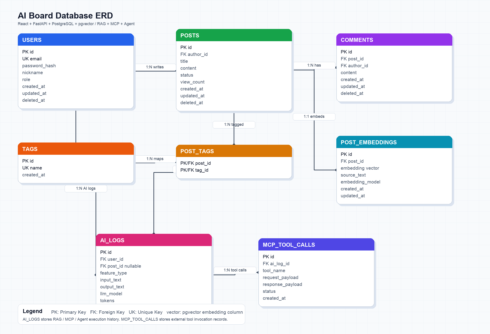

# Database Design

이 문서는 Slack OAuth 기반 내부 사용자 인증을 사용하는 AI 중고거래/게시판 서비스의 데이터베이스 구조를 정리한다.

## ERD



## 설계 기준

- 비로그인 사용자는 게시글 목록과 상세를 조회할 수 있다.
- 글 작성, 댓글 작성, 마이페이지, AI 기능 사용은 로그인 사용자만 가능하다.
- 로그인은 Slack OAuth만 사용한다.
- 정글 Slack 워크스페이스의 `team_id`와 일치하는 사용자만 로그인할 수 있다.
- 서비스는 사용자 비밀번호를 저장하지 않는다.
- 게시글은 중고거래 카드 형태를 지원한다.
- AI 기능은 RAG, MCP, Agent 실행 기록을 남긴다.

## 인증 정책

MVP에서는 **Slack OAuth + Slack workspace team_id 검증**을 사용한다.

```text
1. 사용자가 Slack으로 로그인 버튼을 클릭한다.
2. Slack OAuth 인증 화면으로 이동한다.
3. Slack이 callback URL로 authorization code를 전달한다.
4. 백엔드가 code를 token으로 교환하고 사용자 정보를 조회한다.
5. 응답에 포함된 slack_team_id가 허용된 정글 워크스페이스 ID인지 확인한다.
6. 일치하면 users에 사용자를 생성하거나 기존 사용자를 갱신한다.
7. 서비스 자체 access token을 발급한다.
8. 일치하지 않으면 로그인을 거부한다.
```

## 테이블 목록

| 테이블             | 목적                                |
| ------------------ | ----------------------------------- |
| `slack_workspaces` | 로그인 허용 Slack 워크스페이스 목록 |
| `users`            | Slack OAuth로 로그인한 사용자 계정  |
| `categories`       | 중고거래 게시글 카테고리            |
| `posts`            | 중고거래/게시글 본문                |
| `post_images`      | 게시글 이미지                       |
| `comments`         | 댓글                                |
| `tags`             | 태그                                |
| `post_tags`        | 게시글과 태그의 N:M 연결            |
| `post_embeddings`  | RAG 검색용 게시글 임베딩            |
| `ai_logs`          | RAG, MCP, Agent 실행 기록           |
| `mcp_tool_calls`   | MCP 외부 도구 호출 기록             |

## 주요 관계

| 관계                           | 설명                                                        |
| ------------------------------ | ----------------------------------------------------------- |
| `slack_workspaces` 1:N `users` | 허용된 Slack 워크스페이스에 속한 사용자만 로그인할 수 있다. |
| `users` 1:N `posts`            | 사용자는 여러 게시글을 작성할 수 있다.                      |
| `users` 1:N `comments`         | 사용자는 여러 댓글을 작성할 수 있다.                        |
| `categories` 1:N `posts`       | 카테고리 하나는 여러 게시글을 가진다.                       |
| `posts` 1:N `post_images`      | 게시글 하나는 여러 이미지를 가질 수 있다.                   |
| `posts` 1:N `comments`         | 게시글 하나는 여러 댓글을 가진다.                           |
| `posts` N:M `tags`             | `post_tags`를 통해 게시글과 태그를 연결한다.                |
| `posts` 1:1 `post_embeddings`  | 게시글 하나는 대표 임베딩 하나를 가진다.                    |
| `users` 1:N `ai_logs`          | 사용자는 여러 AI 기능을 실행할 수 있다.                     |
| `ai_logs` 1:N `mcp_tool_calls` | AI 실행 하나에서 여러 MCP 도구 호출이 발생할 수 있다.       |

## 핵심 상태 값

### `users.role`

| 값      | 의미        |
| ------- | ----------- |
| `USER`  | 일반 사용자 |
| `ADMIN` | 관리자      |

### `posts.trade_status`

| 값         | 의미     |
| ---------- | -------- |
| `ON_SALE`  | 판매중   |
| `RESERVED` | 예약중   |
| `SOLD_OUT` | 거래완료 |

### `posts.status`

| 값          | 의미     |
| ----------- | -------- |
| `DRAFT`     | 임시저장 |
| `PUBLISHED` | 공개     |
| `DELETED`   | 삭제     |

### `ai_logs.feature_type`

| 값                | 의미             |
| ----------------- | ---------------- |
| `RAG_QA`          | 게시판 Q&A       |
| `RAG_SIMILAR`     | 유사 게시글 추천 |
| `AI_SUMMARY`      | 게시글 요약      |
| `MCP_FETCH`       | 외부 데이터 조회 |
| `AGENT_WRITE`     | 글쓰기 보조      |
| `AGENT_TAG`       | 태그 추천        |
| `AGENT_DUPLICATE` | 중복 글 확인     |

## 인덱스 후보

| 테이블             | 컬럼                    | 목적                              |
| ------------------ | ----------------------- | --------------------------------- |
| `slack_workspaces` | `slack_team_id`         | Slack 워크스페이스 허용 여부 확인 |
| `users`            | `slack_user_id`         | Slack 사용자 로그인 조회          |
| `users`            | `slack_team_id`         | 워크스페이스별 사용자 조회        |
| `posts`            | `author_id`             | 작성자별 게시글 조회              |
| `posts`            | `category_id`           | 카테고리 필터                     |
| `posts`            | `trade_status`          | 거래 상태 필터                    |
| `posts`            | `created_at`            | 최신순 정렬                       |
| `posts`            | `like_count`            | 인기순 정렬                       |
| `comments`         | `post_id`               | 게시글별 댓글 조회                |
| `post_tags`        | `post_id`, `tag_id`     | 태그 중복 연결 방지               |
| `post_embeddings`  | `embedding`             | 벡터 유사도 검색                  |
| `ai_logs`          | `user_id`, `created_at` | 사용자별 AI 실행 기록 조회        |
| `mcp_tool_calls`   | `ai_log_id`             | AI 실행별 도구 호출 조회          |

## 구현 우선순위

| 순서 | 테이블                               |
| ---- | ------------------------------------ |
| 1    | `slack_workspaces`, `users`          |
| 2    | `categories`, `posts`, `post_images` |
| 3    | `comments`, `tags`, `post_tags`      |
| 4    | `post_embeddings`                    |
| 5    | `ai_logs`, `mcp_tool_calls`          |

## 후속 검토

- Slack OAuth 앱 설치 권한과 redirect URL을 사전에 확인해야 한다.
- Slack에서 탈퇴한 사용자의 서비스 접근 차단 정책을 정해야 한다.
- 좋아요를 사용자별로 관리하려면 `post_likes` 테이블을 추가할 수 있다.
- RAG 품질 향상을 위해 `post_embeddings`를 게시글 단위가 아니라 chunk 단위로 확장할 수 있다.
- MCP 도구가 많아지면 `mcp_tools` 테이블을 별도로 둘 수 있다.
