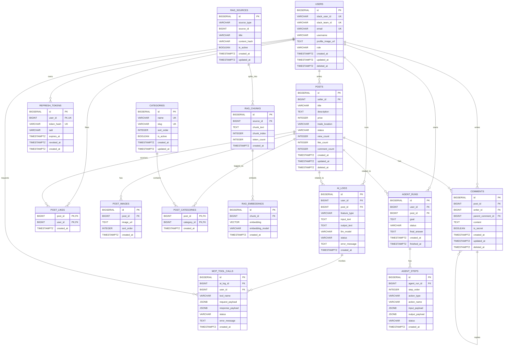

# DB Schema

## 1. 문서 목적

이 문서는 Jungle Market 서비스의 PostgreSQL 데이터베이스 구조를 정의한다.

본 문서는 다음 작업의 기준으로 사용한다.

- FastAPI 모델 설계
- SQLAlchemy ORM 모델 작성
- Alembic 마이그레이션 작성
- API 요청/응답 구조 설계
- ERD 작성
- 데이터 무결성 검토

## 2. 설계 기준

Jungle Market은 Slack 로그인을 사용하는 내부 중고거래 게시판이다.

따라서 DB 설계는 다음 기준을 따른다.

| 기준             | 설명                            |
| ---------------- | ------------------------------- |
| DBMS             | PostgreSQL                      |
| 인증 방식        | Slack OAuth 로그인              |
| 사용자 식별 기준 | `slack_team_id + slack_user_id` |
| 게시글 삭제 방식 | soft delete, `deleted_at` 사용  |
| 시간 타입        | `TIMESTAMPTZ` 사용              |
| 기본 PK 타입     | `BIGSERIAL` 사용                |
| 금액 타입        | MVP에서는 `INTEGER` 사용        |
| 관계 표현        | 1:N, N:1, N:M 기준으로 명시     |
| AI 검색          | PostgreSQL `pgvector` 사용      |
| AI 실행 기록     | 입력, 출력, 도구 호출 로그 저장 |

## 2.1 AI 기능 분류 기준

AI 기능은 RAG, MCP, AI Agent의 역할이 섞이지 않도록 다음 기준으로 분리한다.

| 구분       | 역할                                      | Jungle Market 적용 기능 예시                                                    |
| ---------- | ----------------------------------------- | -------------------------------------------------------------------------------- |
| RAG        | 내부 데이터를 검색 가능한 지식으로 활용   | 유사 게시글 추천, 중복 게시글 감지, 게시글 기반 Q&A, 상품 설명/가격 참고        |
| MCP        | AI가 외부 시스템 또는 도구를 호출         | Slack 알림 전송, URL 메타데이터 조회, S3 이미지 정보 확인, GitHub 이슈 조회     |
| AI Agent   | 목표를 위해 RAG/MCP/LLM 호출을 순서대로 실행 | 판매글 작성 도우미, 거래 문의 요약, 운영자 신고 검토 보조, 자동 태그 추천 흐름 |
| AI Log     | AI 기능 실행 내역과 결과를 추적           | 어떤 사용자가 어떤 입력으로 어떤 AI 결과를 받았는지 저장                        |

### 기능별 설계 방향

| 기능                   | 분류     | DB에 남겨야 하는 이유                                      |
| ---------------------- | -------- | ---------------------------------------------------------- |
| 유사 게시글 추천       | RAG      | 게시글 본문을 벡터화하고 유사도 검색을 해야 한다.          |
| 중복 게시글 감지       | RAG      | 새 게시글과 기존 게시글 chunk를 비교해야 한다.             |
| 게시글 기반 Q&A        | RAG      | 답변 근거가 된 게시글/댓글 chunk를 추적해야 한다.          |
| AI 글쓰기 도우미       | AI Agent | 사용자의 요청, 중간 검색 결과, 최종 생성 결과가 필요하다.  |
| 자동 태그 추천         | AI Agent | 게시글 내용 분석 결과와 추천 태그를 로그로 남길 수 있다.   |
| Slack 알림 전송        | MCP      | 외부 Slack API 호출 성공/실패를 추적해야 한다.             |
| 외부 URL 요약          | MCP      | URL 조회 요청과 응답 payload를 저장해야 디버깅이 가능하다. |
| 신고/운영 검토 보조    | AI Agent | 판단 과정과 최종 추천 조치를 운영자가 확인할 수 있어야 한다. |

## 3. 명명 규칙

| 구분      | 규칙              | 예시                                 |
| --------- | ----------------- | ------------------------------------ |
| 테이블명  | 소문자 복수형     | `users`, `posts`                     |
| 컬럼명    | snake_case        | `created_at`, `seller_id`            |
| PK 컬럼   | `id`              | `users.id`                           |
| FK 컬럼   | 참조 대상 + `_id` | `seller_id`, `post_id`               |
| 생성 시각 | `created_at`      | `TIMESTAMPTZ NOT NULL DEFAULT now()` |
| 수정 시각 | `updated_at`      | `TIMESTAMPTZ NOT NULL DEFAULT now()` |
| 삭제 시각 | `deleted_at`      | `TIMESTAMPTZ NULL`                   |

## 4. 테이블 요약

| 테이블            | 역할                        |
| ----------------- | --------------------------- |
| `users`           | Slack 로그인 사용자         |
| `posts`           | 중고거래 게시글             |
| `categories`      | 게시글 카테고리             |
| `post_categories` | 게시글과 카테고리 연결      |
| `post_likes`      | 게시글 좋아요               |
| `comments`        | 게시글 댓글                 |
| `post_images`     | 게시글 이미지               |
| `refresh_tokens`  | JWT Refresh Token 저장 정보 |
| `rag_sources`     | RAG 원본 데이터 단위        |
| `rag_chunks`      | RAG 검색용 텍스트 조각      |
| `rag_embeddings`  | RAG 벡터 임베딩             |
| `ai_logs`         | AI 기능 실행 로그           |
| `mcp_tool_calls`  | MCP 도구 호출 기록          |
| `agent_runs`      | AI Agent 실행 단위          |
| `agent_steps`     | AI Agent 단계별 실행 기록   |

## 5. 테이블 상세

## 5.1 users

Slack 로그인을 통해 가입한 사용자 정보를 저장한다.

비밀번호 로그인은 사용하지 않으므로 `password_hash` 컬럼은 두지 않는다.

| 컬럼                | 타입           | 필수 | 기본값   | 설명                  |
| ------------------- | -------------- | ---- | -------- | --------------------- |
| `id`                | `BIGSERIAL`    | Yes  |          | 사용자 PK             |
| `slack_user_id`     | `VARCHAR(50)`  | Yes  |          | Slack 사용자 ID       |
| `slack_team_id`     | `VARCHAR(50)`  | Yes  |          | Slack 워크스페이스 ID |
| `email`             | `VARCHAR(255)` | Yes  |          | Slack 계정 이메일     |
| `username`          | `VARCHAR(50)`  | Yes  |          | 화면에 표시할 이름    |
| `profile_image_url` | `TEXT`         | No   |          | 프로필 이미지 URL     |
| `role`              | `VARCHAR(20)`  | Yes  | `'user'` | 사용자 권한           |
| `created_at`        | `TIMESTAMPTZ`  | Yes  | `now()`  | 가입 시각             |
| `updated_at`        | `TIMESTAMPTZ`  | Yes  | `now()`  | 수정 시각             |
| `deleted_at`        | `TIMESTAMPTZ`  | No   |          | 탈퇴 또는 삭제 시각   |

### users 제약조건

| 제약조건                                | 내용                             | 이유                                 |
| --------------------------------------- | -------------------------------- | ------------------------------------ |
| `PRIMARY KEY (id)`                      | 사용자 고유 식별자               | 내부 FK 참조 기준                    |
| `UNIQUE (slack_team_id, slack_user_id)` | 같은 Slack 사용자 중복 가입 방지 | Slack 사용자의 실제 로그인 식별 기준 |
| `UNIQUE (email)`                        | 이메일 중복 방지                 | 같은 이메일로 여러 계정 생성 방지    |
| `CHECK (role IN ('user', 'admin'))`     | 권한 값 제한                     | 잘못된 role 저장 방지                |

### users 설계 근거

- Slack 사용자는 이메일보다 `slack_team_id + slack_user_id` 조합으로 식별하는 것이 안정적이다.
- 이메일은 로그인 보조 정보와 사용자 표시 정보로 사용한다.
- `deleted_at`을 두면 사용자를 바로 삭제하지 않고, 작성글과 댓글 이력을 보존할 수 있다.

## 5.2 posts

중고거래 게시글 정보를 저장한다.

`seller_id`는 게시글 작성자이자 판매자를 의미한다.

| 컬럼             | 타입          | 필수 | 기본값      | 설명           |
| ---------------- | ------------- | ---- | ----------- | -------------- |
| `id`             | `BIGSERIAL`   | Yes  |             | 게시글 PK      |
| `seller_id`      | `BIGINT`      | Yes  |             | 판매자 ID      |
| `title`          | `VARCHAR(80)` | Yes  |             | 게시글 제목    |
| `description`    | `TEXT`        | No   |             | 게시글 설명    |
| `price`          | `INTEGER`     | Yes  |             | 판매 가격      |
| `trade_location` | `VARCHAR(40)` | Yes  |             | 거래 희망 장소 |
| `status`         | `VARCHAR(20)` | Yes  | `'selling'` | 판매 상태      |
| `view_count`     | `INTEGER`     | Yes  | `0`         | 조회 수        |
| `like_count`     | `INTEGER`     | Yes  | `0`         | 좋아요 수      |
| `comment_count`  | `INTEGER`     | Yes  | `0`         | 댓글 수        |
| `created_at`     | `TIMESTAMPTZ` | Yes  | `now()`     | 작성 시각      |
| `updated_at`     | `TIMESTAMPTZ` | Yes  | `now()`     | 수정 시각      |
| `deleted_at`     | `TIMESTAMPTZ` | No   |             | 삭제 시각      |

### posts 제약조건

| 제약조건                                            | 내용                             | 이유                                |
| --------------------------------------------------- | -------------------------------- | ----------------------------------- |
| `PRIMARY KEY (id)`                                  | 게시글 고유 식별자               | 게시글 상세, 댓글, 이미지 참조 기준 |
| `FOREIGN KEY (seller_id) REFERENCES users(id)`      | 게시글은 한 명의 판매자를 가진다 | 존재하지 않는 사용자의 게시글 방지  |
| `CHECK (price >= 0)`                                | 가격은 0원 이상                  | 무료 나눔 허용, 음수 가격 방지      |
| `CHECK (status IN ('selling', 'reserved', 'sold'))` | 판매 상태 제한                   | 상태값 오염 방지                    |
| `CHECK (view_count >= 0)`                           | 조회 수 0 이상                   | 통계값 무결성                       |
| `CHECK (like_count >= 0)`                           | 좋아요 수 0 이상                 | 통계값 무결성                       |
| `CHECK (comment_count >= 0)`                        | 댓글 수 0 이상                   | 통계값 무결성                       |

### posts 설계 근거

- 게시글은 반드시 판매자를 가져야 하므로 `seller_id`는 `NOT NULL`이다.
- `description`은 사용자가 간단히 제목, 가격, 위치만 입력할 수도 있으므로 필수로 두지 않는다.
- `view_count`, `like_count`, `comment_count`는 목록 조회 성능을 위해 캐시성 컬럼으로 둔다.
- 캐시성 카운트 컬럼은 실제 댓글/좋아요 데이터와 동기화 전략이 필요하다.

## 5.3 categories

게시글 카테고리 정보를 저장한다.

| 컬럼         | 타입          | 필수 | 기본값  | 설명                            |
| ------------ | ------------- | ---- | ------- | ------------------------------- |
| `id`         | `BIGSERIAL`   | Yes  |         | 카테고리 PK                     |
| `name`       | `VARCHAR(50)` | Yes  |         | 화면 표시 이름                  |
| `slug`       | `VARCHAR(50)` | Yes  |         | URL 또는 코드에서 사용할 식별값 |
| `sort_order` | `INTEGER`     | Yes  | `0`     | 정렬 순서                       |
| `is_active`  | `BOOLEAN`     | Yes  | `true`  | 사용 여부                       |
| `created_at` | `TIMESTAMPTZ` | Yes  | `now()` | 생성 시각                       |
| `updated_at` | `TIMESTAMPTZ` | Yes  | `now()` | 수정 시각                       |

### categories 제약조건

| 제약조건                  | 내용                    | 이유                  |
| ------------------------- | ----------------------- | --------------------- |
| `PRIMARY KEY (id)`        | 카테고리 고유 식별자    | FK 참조 기준          |
| `UNIQUE (name)`           | 카테고리 이름 중복 방지 | 사용자 화면 혼란 방지 |
| `UNIQUE (slug)`           | slug 중복 방지          | API, URL 식별 안정성  |
| `CHECK (sort_order >= 0)` | 정렬 순서 0 이상        | 잘못된 정렬값 방지    |

### categories 설계 근거

- `name`은 사용자에게 보이는 값이다. 예: 전자기기
- `slug`는 시스템에서 쓰는 값이다. 예: electronics
- `is_active`를 두면 기존 게시글 데이터는 유지하면서 특정 카테고리만 숨길 수 있다.

## 5.4 post_categories

게시글과 카테고리의 연결 정보를 저장한다.

현재 MVP에서 게시글당 카테고리를 1개만 허용하더라도, 이 구조를 사용하면 나중에 다중 카테고리로 확장하기 쉽다.

| 컬럼          | 타입          | 필수 | 기본값  | 설명           |
| ------------- | ------------- | ---- | ------- | -------------- |
| `post_id`     | `BIGINT`      | Yes  |         | 게시글 ID      |
| `category_id` | `BIGINT`      | Yes  |         | 카테고리 ID    |
| `created_at`  | `TIMESTAMPTZ` | Yes  | `now()` | 연결 생성 시각 |

### post_categories 제약조건

| 제약조건                                                       | 내용                                | 이유                      |
| -------------------------------------------------------------- | ----------------------------------- | ------------------------- |
| `PRIMARY KEY (post_id, category_id)`                           | 같은 게시글-카테고리 연결 중복 방지 | 중복 매핑 방지            |
| `FOREIGN KEY (post_id) REFERENCES posts(id) ON DELETE CASCADE` | 게시글 삭제 시 연결 정보 삭제       | 고아 데이터 방지          |
| `FOREIGN KEY (category_id) REFERENCES categories(id)`          | 존재하는 카테고리만 연결            | 잘못된 카테고리 참조 방지 |

## 5.5 post_likes

사용자가 좋아요한 게시글 정보를 저장한다.

| 컬럼         | 타입          | 필수 | 기본값  | 설명             |
| ------------ | ------------- | ---- | ------- | ---------------- |
| `post_id`    | `BIGINT`      | Yes  |         | 게시글 ID        |
| `user_id`    | `BIGINT`      | Yes  |         | 사용자 ID        |
| `created_at` | `TIMESTAMPTZ` | Yes  | `now()` | 좋아요 생성 시각 |

### post_likes 제약조건

| 제약조건                                                       | 내용                                         | 이유                    |
| -------------------------------------------------------------- | -------------------------------------------- | ----------------------- |
| `PRIMARY KEY (post_id, user_id)`                               | 같은 게시글에 같은 사용자가 중복 좋아요 불가 | 좋아요 중복 방지        |
| `FOREIGN KEY (post_id) REFERENCES posts(id) ON DELETE CASCADE` | 게시글 삭제 시 좋아요 삭제                   | 고아 데이터 방지        |
| `FOREIGN KEY (user_id) REFERENCES users(id)`                   | 존재하는 사용자만 좋아요 가능                | 잘못된 사용자 참조 방지 |

## 5.6 comments

게시글 댓글과 대댓글 정보를 저장한다.

`parent_comment_id`가 비어 있으면 일반 댓글이고, 값이 있으면 특정 댓글에 대한 대댓글이다.
MVP에서는 대댓글의 대댓글까지 허용하지 않고 1단계 대댓글만 허용하는 것을 권장한다.

현재 댓글은 공개 댓글을 기준으로 한다. 비밀 댓글 기능이 필요하면 `is_secret BOOLEAN NOT NULL DEFAULT false` 컬럼을 추가할 수 있다.

| 컬럼                | 타입          | 필수 | 기본값  | 설명           |
| ------------------- | ------------- | ---- | ------- | -------------- |
| `id`                | `BIGSERIAL`   | Yes  |         | 댓글 PK        |
| `post_id`           | `BIGINT`      | Yes  |         | 게시글 ID      |
| `writer_id`         | `BIGINT`      | Yes  |         | 댓글 작성자 ID |
| `parent_comment_id` | `BIGINT`      | No   |         | 부모 댓글 ID   |
| `content`           | `TEXT`        | Yes  |         | 댓글 내용      |
| `is_secret`         | `BOOLEAN`     | Yes  | `false` | 비밀댓글 여부  |
| `created_at`        | `TIMESTAMPTZ` | Yes  | `now()` | 작성 시각      |
| `updated_at`        | `TIMESTAMPTZ` | Yes  | `now()` | 수정 시각      |
| `deleted_at`        | `TIMESTAMPTZ` | No   |         | 삭제 시각      |

### comments 제약조건

| 제약조건                                                                    | 내용                           | 이유                          |
| --------------------------------------------------------------------------- | ------------------------------ | ----------------------------- |
| `PRIMARY KEY (id)`                                                          | 댓글 고유 식별자               | 댓글 수정, 삭제 기준          |
| `FOREIGN KEY (post_id) REFERENCES posts(id) ON DELETE CASCADE`              | 댓글은 하나의 게시글에 속한다  | 게시글 삭제 시 댓글 정리      |
| `FOREIGN KEY (writer_id) REFERENCES users(id)`                              | 댓글은 한 명의 작성자를 가진다 | 존재하지 않는 작성자 방지     |
| `FOREIGN KEY (parent_comment_id) REFERENCES comments(id) ON DELETE CASCADE` | 대댓글은 부모 댓글을 참조한다  | 부모 댓글 삭제 시 대댓글 정리 |
| `CHECK (length(trim(content)) > 0)`                                         | 빈 댓글 저장 방지              | 의미 없는 데이터 방지         |

### comments 설계 근거

- 댓글과 대댓글을 하나의 테이블에서 관리하면 댓글 작성/수정/삭제 로직을 단순하게 유지할 수 있다.
- `parent_comment_id`가 `NULL`이면 일반 댓글, 값이 있으면 대댓글로 해석한다.
- `is_secret`이 `true`이면 작성자, 게시글 판매자, 관리자만 원문을 볼 수 있다.
- 중고거래 서비스에서는 깊은 토론 구조보다 간단한 문의 흐름이 중요하므로 1단계 대댓글까지만 권장한다.

## 5.7 post_images

게시글 이미지 정보를 저장한다.

실제 이미지 파일은 DB에 저장하지 않고, 파일 저장소의 URL만 저장한다.

| 컬럼         | 타입          | 필수 | 기본값  | 설명             |
| ------------ | ------------- | ---- | ------- | ---------------- |
| `id`         | `BIGSERIAL`   | Yes  |         | 이미지 PK        |
| `post_id`    | `BIGINT`      | Yes  |         | 게시글 ID        |
| `image_url`  | `TEXT`        | Yes  |         | 이미지 URL       |
| `sort_order` | `INTEGER`     | Yes  | `0`     | 이미지 표시 순서 |
| `created_at` | `TIMESTAMPTZ` | Yes  | `now()` | 생성 시각        |

### post_images 제약조건

| 제약조건                                                       | 내용                            | 이유                            |
| -------------------------------------------------------------- | ------------------------------- | ------------------------------- |
| `PRIMARY KEY (id)`                                             | 이미지 고유 식별자              | 이미지 삭제 기준                |
| `FOREIGN KEY (post_id) REFERENCES posts(id) ON DELETE CASCADE` | 이미지는 하나의 게시글에 속한다 | 게시글 삭제 시 이미지 정보 정리 |
| `CHECK (sort_order >= 0)`                                      | 표시 순서 0 이상                | 잘못된 정렬값 방지              |

## 5.8 refresh_tokens

사용자의 Refresh Token 저장 정보를 관리한다.

보안을 위해 원본 Refresh Token은 저장하지 않고, SHA-256 해시값과 salt만 저장한다.

| 컬럼 | 타입 | 필수 | 기본값 | 설명 |
| --- | --- | --- | --- | --- |
| `id` | `BIGSERIAL` | Yes | | Refresh Token PK |
| `user_id` | `BIGINT` | Yes | | 사용자 ID |
| `token_hash` | `VARCHAR(64)` | Yes | | Refresh Token 해시값 |
| `salt` | `VARCHAR(32)` | Yes | | Refresh Token 해시용 salt |
| `expires_at` | `TIMESTAMPTZ` | Yes | | 만료 시각 |
| `revoked_at` | `TIMESTAMPTZ` | No | | 폐기 시각 |
| `created_at` | `TIMESTAMPTZ` | Yes | `now()` | 생성 시각 |

### refresh_tokens 제약조건

| 제약조건 | 내용 | 이유 |
| --- | --- | --- |
| `PRIMARY KEY (id)` | Refresh Token 고유 식별자 | 토큰 관리 기준 |
| `FOREIGN KEY (user_id) REFERENCES users(id)` | Refresh Token은 한 사용자에 속한다 | 존재하지 않는 사용자 방지 |
| `UNIQUE (user_id)` | 사용자당 Refresh Token 1개만 저장 | 재발급 시 기존 토큰 교체를 보장 |
| `UNIQUE (token_hash)` | 같은 토큰 해시 중복 저장 방지 | 중복 토큰 저장 방지 |

### refresh_tokens 설계 근거

- Access Token은 짧게 유지하고, Refresh Token으로 재발급한다.
- 현재 MVP는 reference 구현처럼 사용자당 Refresh Token 1개만 저장하고, 재발급 시 새 토큰으로 교체한다.
- 로그아웃 시 저장된 Refresh Token row를 삭제해 토큰을 무효화한다.
- `revoked_at`은 추후 토큰 폐기 이력을 남기는 방식으로 확장할 때 사용할 수 있다.
- DB 유출 위험을 줄이기 위해 원본 토큰이 아닌 `refresh_token + salt`의 SHA-256 해시값만 저장한다.

## 5.9 rag_sources

RAG 검색에 사용할 원본 데이터 단위를 저장한다.

게시글, 댓글, 운영 문서처럼 출처가 다른 데이터를 하나의 RAG 파이프라인으로 다루기 위해 원본 종류와 원본 ID를 함께 저장한다.

| 컬럼          | 타입          | 필수 | 기본값    | 설명                                      |
| ------------- | ------------- | ---- | --------- | ----------------------------------------- |
| `id`          | `BIGSERIAL`   | Yes  |           | RAG 원본 PK                               |
| `source_type` | `VARCHAR(30)` | Yes  |           | 원본 종류. `post`, `comment`, `faq` |
| `source_id`   | `BIGINT`      | No   |           | 원본 테이블의 ID                          |
| `title`       | `VARCHAR(120)`| No   |           | 원본 제목 또는 표시 이름                  |
| `content_hash`| `VARCHAR(64)` | Yes  |           | 원본 내용 변경 감지용 해시                |
| `is_active`   | `BOOLEAN`     | Yes  | `true`    | RAG 검색 사용 여부                        |
| `created_at`  | `TIMESTAMPTZ` | Yes  | `now()`   | 생성 시각                                 |
| `updated_at`  | `TIMESTAMPTZ` | Yes  | `now()`   | 수정 시각                                 |

### rag_sources 제약조건

| 제약조건                                      | 내용                    | 이유                          |
| --------------------------------------------- | ----------------------- | ----------------------------- |
| `PRIMARY KEY (id)`                            | RAG 원본 고유 식별자    | chunk, embedding 참조 기준    |
| `UNIQUE (source_type, source_id)`             | 같은 원본 중복 등록 방지 | 중복 임베딩 생성 방지         |
| `CHECK (source_type IN (...))`                | 원본 종류 제한          | 잘못된 source_type 저장 방지  |

### rag_sources 설계 근거

- `posts`, `comments`, 운영 문서를 직접 FK로 모두 연결하면 RAG 대상이 늘어날 때마다 테이블 구조를 바꿔야 한다.
- 따라서 `source_type + source_id`를 사용해 원본을 느슨하게 참조한다.
- 실제 원본 존재 여부와 권한 검사는 애플리케이션 로직에서 처리한다.

## 5.10 rag_chunks

RAG 검색을 위해 원본 텍스트를 작은 단위로 나눈 결과를 저장한다.

| 컬럼          | 타입          | 필수 | 기본값  | 설명              |
| ------------- | ------------- | ---- | ------- | ----------------- |
| `id`          | `BIGSERIAL`   | Yes  |         | chunk PK          |
| `source_id`   | `BIGINT`      | Yes  |         | RAG 원본 ID       |
| `chunk_text`  | `TEXT`        | Yes  |         | 검색 대상 텍스트  |
| `chunk_index` | `INTEGER`     | Yes  | `0`     | 원본 내 chunk 순서 |
| `token_count` | `INTEGER`     | No   |         | 토큰 수           |
| `created_at`  | `TIMESTAMPTZ` | Yes  | `now()` | 생성 시각         |

### rag_chunks 제약조건

| 제약조건                                                           | 내용                               | 이유                    |
| ------------------------------------------------------------------ | ---------------------------------- | ----------------------- |
| `PRIMARY KEY (id)`                                                 | chunk 고유 식별자                  | embedding 참조 기준     |
| `FOREIGN KEY (source_id) REFERENCES rag_sources(id) ON DELETE CASCADE` | 원본 삭제 시 chunk 삭제         | 고아 데이터 방지        |
| `UNIQUE (source_id, chunk_index)`                                  | 같은 원본 내 chunk 순서 중복 방지  | chunk 순서 무결성       |
| `CHECK (chunk_index >= 0)`                                         | chunk 순서 0 이상                  | 잘못된 순서값 방지      |
| `CHECK (length(trim(chunk_text)) > 0)`                             | 빈 chunk 저장 방지                 | 검색 품질 유지          |

### rag_chunks 설계 근거

- 긴 게시글 하나를 통째로 임베딩하면 검색 정확도가 떨어질 수 있다.
- chunk 단위로 저장하면 질문과 가장 가까운 일부 문장만 찾아 답변 근거로 사용할 수 있다.

## 5.11 rag_embeddings

RAG 유사도 검색을 위한 벡터 임베딩을 저장한다.

PostgreSQL에서는 `pgvector` 확장을 사용한다.

| 컬럼              | 타입          | 필수 | 기본값  | 설명                   |
| ----------------- | ------------- | ---- | ------- | ---------------------- |
| `id`              | `BIGSERIAL`   | Yes  |         | embedding PK           |
| `chunk_id`        | `BIGINT`      | Yes  |         | chunk ID               |
| `embedding`       | `VECTOR`      | Yes  |         | 임베딩 벡터            |
| `embedding_model` | `VARCHAR(80)` | Yes  |         | 임베딩 모델 이름       |
| `created_at`      | `TIMESTAMPTZ` | Yes  | `now()` | 생성 시각              |

### rag_embeddings 제약조건

| 제약조건                                                           | 내용                          | 이유                         |
| ------------------------------------------------------------------ | ----------------------------- | ---------------------------- |
| `PRIMARY KEY (id)`                                                 | embedding 고유 식별자         | 벡터 검색 기준               |
| `FOREIGN KEY (chunk_id) REFERENCES rag_chunks(id) ON DELETE CASCADE` | chunk 삭제 시 embedding 삭제 | 고아 데이터 방지             |
| `UNIQUE (chunk_id, embedding_model)`                               | 같은 모델의 중복 embedding 방지 | 중복 벡터 저장 방지        |

### rag_embeddings 설계 근거

- 같은 chunk라도 임베딩 모델이 바뀌면 벡터를 다시 만들어야 한다.
- `embedding_model`을 저장하면 모델 교체나 재색인 시 어떤 벡터를 다시 만들지 판단할 수 있다.

## 5.12 ai_logs

AI 기능 실행 내역을 저장한다.

RAG 검색, 글쓰기 도움, 태그 추천, 신고 검토처럼 사용자가 AI 기능을 호출한 기록을 남긴다.

| 컬럼            | 타입           | 필수 | 기본값     | 설명                                      |
| --------------- | -------------- | ---- | ---------- | ----------------------------------------- |
| `id`            | `BIGSERIAL`    | Yes  |            | AI 로그 PK                                |
| `user_id`       | `BIGINT`       | No   |            | 요청 사용자 ID                            |
| `post_id`       | `BIGINT`       | No   |            | 관련 게시글 ID                            |
| `feature_type`  | `VARCHAR(40)`  | Yes  |            | AI 기능 종류                              |
| `input_text`    | `TEXT`         | No   |            | 사용자 입력                               |
| `output_text`   | `TEXT`         | No   |            | AI 출력                                   |
| `llm_model`     | `VARCHAR(80)`  | No   |            | 사용한 LLM 모델                           |
| `status`        | `VARCHAR(20)`  | Yes  | `'success'`| 실행 상태                                 |
| `error_message` | `TEXT`         | No   |            | 실패 사유                                 |
| `created_at`    | `TIMESTAMPTZ`  | Yes  | `now()`    | 생성 시각                                 |

### ai_logs 제약조건

| 제약조건                                      | 내용                         | 이유                    |
| --------------------------------------------- | ---------------------------- | ----------------------- |
| `PRIMARY KEY (id)`                            | AI 로그 고유 식별자          | 디버깅, 감사 기준       |
| `FOREIGN KEY (user_id) REFERENCES users(id)`  | 사용자가 있는 경우 연결      | 사용자별 AI 사용 추적   |
| `FOREIGN KEY (post_id) REFERENCES posts(id)`  | 관련 게시글이 있는 경우 연결 | 게시글별 AI 기능 추적   |
| `CHECK (status IN ('success', 'failed'))`     | 실행 상태 제한               | 잘못된 상태값 방지      |

### ai_logs 설계 근거

- AI 기능은 실패 원인을 추적하기 어려우므로 입력, 출력, 모델, 상태를 최소한으로 남긴다.
- 비용 분석이 필요해지면 추후 `prompt_tokens`, `completion_tokens`, `cost` 컬럼을 추가할 수 있다.

## 5.13 mcp_tool_calls

MCP를 통해 외부 도구를 호출한 기록을 저장한다.

Slack 알림, GitHub 조회, 외부 URL 메타데이터 조회처럼 AI가 외부 시스템을 호출한 내역을 추적한다.

| 컬럼               | 타입          | 필수 | 기본값     | 설명                      |
| ------------------ | ------------- | ---- | ---------- | ------------------------- |
| `id`               | `BIGSERIAL`   | Yes  |            | MCP 호출 PK               |
| `ai_log_id`        | `BIGINT`      | No   |            | 관련 AI 로그 ID           |
| `user_id`          | `BIGINT`      | No   |            | 요청 사용자 ID            |
| `tool_name`        | `VARCHAR(80)` | Yes  |            | 호출한 MCP tool 이름      |
| `request_payload`  | `JSONB`       | No   |            | 요청 payload              |
| `response_payload` | `JSONB`       | No   |            | 응답 payload              |
| `status`           | `VARCHAR(20)` | Yes  | `'success'`| 호출 상태                 |
| `error_message`    | `TEXT`        | No   |            | 실패 사유                 |
| `created_at`       | `TIMESTAMPTZ` | Yes  | `now()`    | 생성 시각                 |

### mcp_tool_calls 제약조건

| 제약조건                                           | 내용                    | 이유                    |
| -------------------------------------------------- | ----------------------- | ----------------------- |
| `PRIMARY KEY (id)`                                 | MCP 호출 고유 식별자    | 외부 호출 추적 기준     |
| `FOREIGN KEY (ai_log_id) REFERENCES ai_logs(id)`   | AI 실행과 연결          | AI 결과의 근거 추적     |
| `FOREIGN KEY (user_id) REFERENCES users(id)`       | 사용자가 있는 경우 연결 | 사용자별 도구 사용 추적 |
| `CHECK (status IN ('success', 'failed'))`          | 호출 상태 제한          | 잘못된 상태값 방지      |

### mcp_tool_calls 설계 근거

- MCP 호출은 외부 시스템 상태에 따라 실패할 수 있으므로 요청/응답과 실패 사유를 남긴다.
- `JSONB`를 사용하면 도구마다 다른 payload 형태를 유연하게 저장할 수 있다.

## 5.14 agent_runs

AI Agent의 실행 단위를 저장한다.

사용자의 하나의 목표를 처리하기 위해 여러 단계의 RAG 검색, MCP 호출, LLM 호출이 발생할 수 있다.

| 컬럼           | 타입          | 필수 | 기본값      | 설명             |
| -------------- | ------------- | ---- | ----------- | ---------------- |
| `id`           | `BIGSERIAL`   | Yes  |             | Agent 실행 PK    |
| `user_id`      | `BIGINT`      | No   |             | 요청 사용자 ID   |
| `post_id`      | `BIGINT`      | No   |             | 관련 게시글 ID   |
| `goal`         | `TEXT`        | Yes  |             | 사용자의 목표    |
| `status`       | `VARCHAR(20)` | Yes  | `'running'` | 실행 상태        |
| `final_answer` | `TEXT`        | No   |             | 최종 결과        |
| `created_at`   | `TIMESTAMPTZ` | Yes  | `now()`     | 시작 시각        |
| `finished_at`  | `TIMESTAMPTZ` | No   |             | 종료 시각        |

### agent_runs 제약조건

| 제약조건                                               | 내용                         | 이유                  |
| ------------------------------------------------------ | ---------------------------- | --------------------- |
| `PRIMARY KEY (id)`                                     | Agent 실행 고유 식별자       | 단계별 실행 참조 기준 |
| `FOREIGN KEY (user_id) REFERENCES users(id)`           | 사용자가 있는 경우 연결      | 사용자별 실행 추적    |
| `FOREIGN KEY (post_id) REFERENCES posts(id)`           | 관련 게시글이 있는 경우 연결 | 게시글별 실행 추적    |
| `CHECK (status IN ('running', 'success', 'failed', 'stopped'))` | 실행 상태 제한       | 잘못된 상태값 방지    |

### agent_runs 설계 근거

- Agent는 단순한 한 번의 LLM 호출이 아니라 여러 행동을 묶은 실행 단위이다.
- 실행 상태와 최종 결과를 분리해서 저장하면 중간 실패나 사용자 중단도 추적할 수 있다.

## 5.15 agent_steps

AI Agent가 실행한 단계별 기록을 저장한다.

| 컬럼             | 타입          | 필수 | 기본값     | 설명                            |
| ---------------- | ------------- | ---- | ---------- | ------------------------------- |
| `id`             | `BIGSERIAL`   | Yes  |            | Agent 단계 PK                   |
| `agent_run_id`   | `BIGINT`      | Yes  |            | Agent 실행 ID                   |
| `step_order`     | `INTEGER`     | Yes  |            | 단계 순서                       |
| `action_type`    | `VARCHAR(40)` | Yes  |            | `rag_search`, `mcp_call`, `llm` |
| `action_name`    | `VARCHAR(80)` | No   |            | 세부 행동 이름                  |
| `input_payload`  | `JSONB`       | No   |            | 단계 입력                       |
| `output_payload` | `JSONB`       | No   |            | 단계 출력                       |
| `status`         | `VARCHAR(20)` | Yes  | `'success'`| 단계 상태                       |
| `created_at`     | `TIMESTAMPTZ` | Yes  | `now()`    | 생성 시각                       |

### agent_steps 제약조건

| 제약조건                                                       | 내용                              | 이유                    |
| -------------------------------------------------------------- | --------------------------------- | ----------------------- |
| `PRIMARY KEY (id)`                                             | Agent 단계 고유 식별자            | 단계 추적 기준          |
| `FOREIGN KEY (agent_run_id) REFERENCES agent_runs(id) ON DELETE CASCADE` | 실행 삭제 시 단계 삭제  | 고아 데이터 방지        |
| `UNIQUE (agent_run_id, step_order)`                            | 같은 실행 내 단계 순서 중복 방지  | 실행 순서 무결성        |
| `CHECK (step_order > 0)`                                       | 단계 순서 1 이상                  | 잘못된 순서값 방지      |
| `CHECK (status IN ('success', 'failed', 'skipped'))`           | 단계 상태 제한                    | 잘못된 상태값 방지      |

### agent_steps 설계 근거

- Agent는 결과만 보면 왜 그런 답변이 나왔는지 알기 어렵다.
- 단계별 입력과 출력을 저장하면 디버깅, 발표 설명, 실패 원인 분석이 쉬워진다.

## 6. 관계 정의

## 6.1 관계 요약

| From              | 관계 | To                | 설명                                                           |
| ----------------- | ---- | ----------------- | -------------------------------------------------------------- |
| `users`           | 1:N  | `posts`           | 한 사용자는 여러 게시글을 작성할 수 있다.                      |
| `users`           | 1:N  | `comments`        | 한 사용자는 여러 댓글을 작성할 수 있다.                        |
| `users`           | 1:N  | `post_likes`      | 한 사용자는 여러 게시글에 좋아요를 누를 수 있다.               |
| `users`           | 1:1  | `refresh_tokens`  | 한 사용자는 하나의 활성 Refresh Token을 가진다.                |
| `posts`           | N:1  | `users`           | 한 게시글은 한 명의 판매자를 가진다.                           |
| `posts`           | 1:N  | `comments`        | 한 게시글은 여러 댓글을 가질 수 있다.                          |
| `posts`           | 1:N  | `post_images`     | 한 게시글은 여러 이미지를 가질 수 있다.                        |
| `posts`           | 1:N  | `post_likes`      | 한 게시글은 여러 좋아요를 받을 수 있다.                        |
| `posts`           | 1:N  | `post_categories` | 한 게시글은 여러 카테고리 연결 정보를 가질 수 있다.            |
| `categories`      | 1:N  | `post_categories` | 한 카테고리는 여러 게시글과 연결될 수 있다.                    |
| `post_categories` | N:1  | `posts`           | 하나의 연결 정보는 하나의 게시글을 참조한다.                   |
| `post_categories` | N:1  | `categories`      | 하나의 연결 정보는 하나의 카테고리를 참조한다.                 |
| `post_likes`      | N:1  | `users`           | 하나의 좋아요는 한 사용자가 만든다.                            |
| `post_likes`      | N:1  | `posts`           | 하나의 좋아요는 한 게시글에 속한다.                            |
| `comments`        | N:1  | `users`           | 하나의 댓글은 한 사용자가 작성한다.                            |
| `comments`        | N:1  | `posts`           | 하나의 댓글은 한 게시글에 속한다.                              |
| `comments`        | 1:N  | `comments`        | 하나의 댓글은 여러 대댓글을 가질 수 있다.                      |
| `post_images`     | N:1  | `posts`           | 하나의 이미지는 한 게시글에 속한다.                            |
| `rag_sources`     | 1:N  | `rag_chunks`      | 하나의 RAG 원본은 여러 chunk로 나뉠 수 있다.                   |
| `rag_chunks`      | 1:N  | `rag_embeddings`  | 하나의 chunk는 모델별 embedding을 가질 수 있다.                |
| `users`           | 1:N  | `ai_logs`         | 한 사용자는 여러 AI 기능을 실행할 수 있다.                     |
| `posts`           | 1:N  | `ai_logs`         | 한 게시글은 여러 AI 실행 로그와 연결될 수 있다.                |
| `ai_logs`         | 1:N  | `mcp_tool_calls`  | 하나의 AI 실행은 여러 MCP 도구 호출을 가질 수 있다.            |
| `users`           | 1:N  | `mcp_tool_calls`  | 한 사용자는 여러 MCP 도구 호출을 발생시킬 수 있다.             |
| `users`           | 1:N  | `agent_runs`      | 한 사용자는 여러 Agent 실행을 시작할 수 있다.                  |
| `posts`           | 1:N  | `agent_runs`      | 한 게시글은 여러 Agent 실행과 연결될 수 있다.                  |
| `agent_runs`      | 1:N  | `agent_steps`     | 하나의 Agent 실행은 여러 단계를 가진다.                        |

## 6.2 Mermaid ERD



## 7. PostgreSQL DDL 초안

아래 SQL은 실제 마이그레이션 작성 전 참고용 초안이다.

```sql
CREATE EXTENSION IF NOT EXISTS vector;

CREATE TABLE users (
    id BIGSERIAL PRIMARY KEY,
    slack_user_id VARCHAR(50) NOT NULL,
    slack_team_id VARCHAR(50) NOT NULL,
    email VARCHAR(255) NOT NULL,
    username VARCHAR(50) NOT NULL,
    profile_image_url TEXT,
    role VARCHAR(20) NOT NULL DEFAULT 'user',
    created_at TIMESTAMPTZ NOT NULL DEFAULT now(),
    updated_at TIMESTAMPTZ NOT NULL DEFAULT now(),
    deleted_at TIMESTAMPTZ,
    CONSTRAINT uq_users_slack_identity UNIQUE (slack_team_id, slack_user_id),
    CONSTRAINT uq_users_email UNIQUE (email),
    CONSTRAINT ck_users_role CHECK (role IN ('user', 'admin'))
);

CREATE TABLE posts (
    id BIGSERIAL PRIMARY KEY,
    seller_id BIGINT NOT NULL REFERENCES users(id),
    title VARCHAR(80) NOT NULL,
    description TEXT,
    price INTEGER NOT NULL,
    trade_location VARCHAR(40) NOT NULL,
    status VARCHAR(20) NOT NULL DEFAULT 'selling',
    view_count INTEGER NOT NULL DEFAULT 0,
    like_count INTEGER NOT NULL DEFAULT 0,
    comment_count INTEGER NOT NULL DEFAULT 0,
    created_at TIMESTAMPTZ NOT NULL DEFAULT now(),
    updated_at TIMESTAMPTZ NOT NULL DEFAULT now(),
    deleted_at TIMESTAMPTZ,
    CONSTRAINT ck_posts_price CHECK (price >= 0),
    CONSTRAINT ck_posts_status CHECK (status IN ('selling', 'reserved', 'sold')),
    CONSTRAINT ck_posts_view_count CHECK (view_count >= 0),
    CONSTRAINT ck_posts_like_count CHECK (like_count >= 0),
    CONSTRAINT ck_posts_comment_count CHECK (comment_count >= 0)
);

CREATE TABLE categories (
    id BIGSERIAL PRIMARY KEY,
    name VARCHAR(50) NOT NULL,
    slug VARCHAR(50) NOT NULL,
    sort_order INTEGER NOT NULL DEFAULT 0,
    is_active BOOLEAN NOT NULL DEFAULT true,
    created_at TIMESTAMPTZ NOT NULL DEFAULT now(),
    updated_at TIMESTAMPTZ NOT NULL DEFAULT now(),
    CONSTRAINT uq_categories_name UNIQUE (name),
    CONSTRAINT uq_categories_slug UNIQUE (slug),
    CONSTRAINT ck_categories_sort_order CHECK (sort_order >= 0)
);

CREATE TABLE post_categories (
    post_id BIGINT NOT NULL REFERENCES posts(id) ON DELETE CASCADE,
    category_id BIGINT NOT NULL REFERENCES categories(id),
    created_at TIMESTAMPTZ NOT NULL DEFAULT now(),
    PRIMARY KEY (post_id, category_id)
);

CREATE TABLE post_likes (
    post_id BIGINT NOT NULL REFERENCES posts(id) ON DELETE CASCADE,
    user_id BIGINT NOT NULL REFERENCES users(id),
    created_at TIMESTAMPTZ NOT NULL DEFAULT now(),
    PRIMARY KEY (post_id, user_id)
);

CREATE TABLE comments (
    id BIGSERIAL PRIMARY KEY,
    post_id BIGINT NOT NULL REFERENCES posts(id) ON DELETE CASCADE,
    writer_id BIGINT NOT NULL REFERENCES users(id),
    parent_comment_id BIGINT REFERENCES comments(id) ON DELETE CASCADE,
    content TEXT NOT NULL,
    is_secret BOOLEAN NOT NULL DEFAULT false,
    created_at TIMESTAMPTZ NOT NULL DEFAULT now(),
    updated_at TIMESTAMPTZ NOT NULL DEFAULT now(),
    deleted_at TIMESTAMPTZ,
    CONSTRAINT ck_comments_content CHECK (length(trim(content)) > 0)
);

CREATE TABLE post_images (
    id BIGSERIAL PRIMARY KEY,
    post_id BIGINT NOT NULL REFERENCES posts(id) ON DELETE CASCADE,
    image_url TEXT NOT NULL,
    sort_order INTEGER NOT NULL DEFAULT 0,
    created_at TIMESTAMPTZ NOT NULL DEFAULT now(),
    CONSTRAINT ck_post_images_sort_order CHECK (sort_order >= 0)
);

CREATE TABLE refresh_tokens (
    id BIGSERIAL PRIMARY KEY,
    user_id BIGINT NOT NULL REFERENCES users(id),
    token_hash VARCHAR(64) NOT NULL,
    salt VARCHAR(32) NOT NULL,
    expires_at TIMESTAMPTZ NOT NULL,
    revoked_at TIMESTAMPTZ,
    created_at TIMESTAMPTZ NOT NULL DEFAULT now(),
    CONSTRAINT uq_refresh_tokens_user_id UNIQUE (user_id),
    CONSTRAINT uq_refresh_tokens_token_hash UNIQUE (token_hash)
);

CREATE TABLE rag_sources (
    id BIGSERIAL PRIMARY KEY,
    source_type VARCHAR(30) NOT NULL,
    source_id BIGINT,
    title VARCHAR(120),
    content_hash VARCHAR(64) NOT NULL,
    is_active BOOLEAN NOT NULL DEFAULT true,
    created_at TIMESTAMPTZ NOT NULL DEFAULT now(),
    updated_at TIMESTAMPTZ NOT NULL DEFAULT now(),
    CONSTRAINT uq_rag_sources_source UNIQUE (source_type, source_id),
    CONSTRAINT ck_rag_sources_type CHECK (source_type IN ('post', 'comment', 'faq'))
);

CREATE TABLE rag_chunks (
    id BIGSERIAL PRIMARY KEY,
    source_id BIGINT NOT NULL REFERENCES rag_sources(id) ON DELETE CASCADE,
    chunk_text TEXT NOT NULL,
    chunk_index INTEGER NOT NULL DEFAULT 0,
    token_count INTEGER,
    created_at TIMESTAMPTZ NOT NULL DEFAULT now(),
    CONSTRAINT uq_rag_chunks_source_index UNIQUE (source_id, chunk_index),
    CONSTRAINT ck_rag_chunks_index CHECK (chunk_index >= 0),
    CONSTRAINT ck_rag_chunks_text CHECK (length(trim(chunk_text)) > 0)
);

CREATE TABLE rag_embeddings (
    id BIGSERIAL PRIMARY KEY,
    chunk_id BIGINT NOT NULL REFERENCES rag_chunks(id) ON DELETE CASCADE,
    embedding vector,
    embedding_model VARCHAR(80) NOT NULL,
    created_at TIMESTAMPTZ NOT NULL DEFAULT now(),
    CONSTRAINT uq_rag_embeddings_chunk_model UNIQUE (chunk_id, embedding_model)
);

CREATE TABLE ai_logs (
    id BIGSERIAL PRIMARY KEY,
    user_id BIGINT REFERENCES users(id),
    post_id BIGINT REFERENCES posts(id),
    feature_type VARCHAR(40) NOT NULL,
    input_text TEXT,
    output_text TEXT,
    llm_model VARCHAR(80),
    status VARCHAR(20) NOT NULL DEFAULT 'success',
    error_message TEXT,
    created_at TIMESTAMPTZ NOT NULL DEFAULT now(),
    CONSTRAINT ck_ai_logs_status CHECK (status IN ('success', 'failed'))
);

CREATE TABLE mcp_tool_calls (
    id BIGSERIAL PRIMARY KEY,
    ai_log_id BIGINT REFERENCES ai_logs(id),
    user_id BIGINT REFERENCES users(id),
    tool_name VARCHAR(80) NOT NULL,
    request_payload JSONB,
    response_payload JSONB,
    status VARCHAR(20) NOT NULL DEFAULT 'success',
    error_message TEXT,
    created_at TIMESTAMPTZ NOT NULL DEFAULT now(),
    CONSTRAINT ck_mcp_tool_calls_status CHECK (status IN ('success', 'failed'))
);

CREATE TABLE agent_runs (
    id BIGSERIAL PRIMARY KEY,
    user_id BIGINT REFERENCES users(id),
    post_id BIGINT REFERENCES posts(id),
    goal TEXT NOT NULL,
    status VARCHAR(20) NOT NULL DEFAULT 'running',
    final_answer TEXT,
    created_at TIMESTAMPTZ NOT NULL DEFAULT now(),
    finished_at TIMESTAMPTZ,
    CONSTRAINT ck_agent_runs_status CHECK (status IN ('running', 'success', 'failed', 'stopped'))
);

CREATE TABLE agent_steps (
    id BIGSERIAL PRIMARY KEY,
    agent_run_id BIGINT NOT NULL REFERENCES agent_runs(id) ON DELETE CASCADE,
    step_order INTEGER NOT NULL,
    action_type VARCHAR(40) NOT NULL,
    action_name VARCHAR(80),
    input_payload JSONB,
    output_payload JSONB,
    status VARCHAR(20) NOT NULL DEFAULT 'success',
    created_at TIMESTAMPTZ NOT NULL DEFAULT now(),
    CONSTRAINT uq_agent_steps_run_order UNIQUE (agent_run_id, step_order),
    CONSTRAINT ck_agent_steps_order CHECK (step_order > 0),
    CONSTRAINT ck_agent_steps_status CHECK (status IN ('success', 'failed', 'skipped'))
);
```

## 8. 인덱스 권장사항

| 인덱스             | SQL 예시                                                                                     | 목적                      |
| ------------------ | -------------------------------------------------------------------------------------------- | ------------------------- |
| Slack 사용자 조회  | `CREATE INDEX idx_users_slack_identity ON users(slack_team_id, slack_user_id);`              | 로그인 시 사용자 조회     |
| 게시글 최신순 조회 | `CREATE INDEX idx_posts_created_at ON posts(created_at DESC);`                               | 메인 목록 최신순          |
| 판매중 게시글 조회 | `CREATE INDEX idx_posts_status_created_at ON posts(status, created_at DESC);`                | 판매중 필터               |
| 판매자 게시글 조회 | `CREATE INDEX idx_posts_seller_id ON posts(seller_id);`                                      | 마이페이지 내 글 목록     |
| 게시글 댓글 조회   | `CREATE INDEX idx_comments_post_id ON comments(post_id);`                                    | 상세 페이지 댓글 목록     |
| 대댓글 조회        | `CREATE INDEX idx_comments_parent_comment_id ON comments(parent_comment_id);`                | 댓글별 대댓글 목록        |
| 게시글 이미지 조회 | `CREATE INDEX idx_post_images_post_id ON post_images(post_id);`                              | 상세 페이지 이미지 목록   |
| 사용자 좋아요 조회 | `CREATE INDEX idx_post_likes_user_id ON post_likes(user_id);`                                | 사용자가 좋아요한 글 조회 |
| Refresh Token 조회 | `CREATE INDEX idx_refresh_tokens_user_id ON refresh_tokens(user_id);`                        | 사용자별 토큰 관리        |
| RAG 원본 조회      | `CREATE INDEX idx_rag_sources_source ON rag_sources(source_type, source_id);`                | 원본 데이터별 RAG 동기화  |
| RAG chunk 조회     | `CREATE INDEX idx_rag_chunks_source_id ON rag_chunks(source_id);`                            | 원본별 chunk 조회         |
| RAG 벡터 검색      | `CREATE INDEX idx_rag_embeddings_vector ON rag_embeddings USING ivfflat (embedding vector_cosine_ops);` | 유사도 검색 |
| AI 로그 사용자 조회 | `CREATE INDEX idx_ai_logs_user_created_at ON ai_logs(user_id, created_at DESC);`            | 사용자별 AI 사용 내역     |
| AI 로그 게시글 조회 | `CREATE INDEX idx_ai_logs_post_id ON ai_logs(post_id);`                                     | 게시글별 AI 사용 내역     |
| MCP 호출 로그 조회 | `CREATE INDEX idx_mcp_tool_calls_ai_log_id ON mcp_tool_calls(ai_log_id);`                   | AI 실행별 MCP 호출 조회   |
| Agent 실행 조회    | `CREATE INDEX idx_agent_runs_user_created_at ON agent_runs(user_id, created_at DESC);`       | 사용자별 Agent 실행 내역  |
| Agent 단계 조회    | `CREATE INDEX idx_agent_steps_run_order ON agent_steps(agent_run_id, step_order);`           | Agent 단계 순서 조회      |

## 9. 실무 관점 검토사항

## 9.1 BIGSERIAL 사용 여부

현재 문서는 `BIGSERIAL`을 기준으로 작성했다.

PostgreSQL 최신 스타일에서는 다음처럼 `IDENTITY` 문법을 사용할 수도 있다.

```sql
id BIGINT GENERATED BY DEFAULT AS IDENTITY PRIMARY KEY
```

MVP에서는 `BIGSERIAL`도 충분히 사용 가능하다.

## 9.2 카테고리 구조

현재 설계는 `post_categories`를 사용한다.

장점은 다음과 같다.

- 게시글 1개에 카테고리 1개만 붙이는 것도 가능하다.
- 나중에 게시글 1개에 여러 카테고리를 붙이는 것도 가능하다.

단점은 다음과 같다.

- 단순 MVP에서는 `posts.category_id` 하나만 두는 방식보다 테이블이 하나 더 많다.

## 9.3 카운트 컬럼

`like_count`, `comment_count`, `view_count`는 조회 성능을 위해 둔 컬럼이다.

다만 실제 좋아요, 댓글 데이터와 숫자가 어긋나지 않도록 다음 중 하나의 전략이 필요하다.

- 애플리케이션 코드에서 좋아요/댓글 생성 시 함께 증가
- DB 트리거 사용
- 일정 주기로 재계산

MVP에서는 애플리케이션 코드에서 함께 갱신하는 방식이 가장 단순하다.

## 9.4 Soft Delete

`users`, `posts`, `comments`에는 `deleted_at`을 둔다.

이 방식은 데이터를 바로 삭제하지 않고 삭제 시각만 기록한다.

장점은 다음과 같다.

- 운영자가 문제 상황을 추적할 수 있다.
- 댓글, 게시글 이력을 일정 기간 보존할 수 있다.
- 실수로 삭제한 데이터를 복구할 여지가 있다.

주의할 점은 다음과 같다.

- 일반 목록 조회에서는 `deleted_at IS NULL` 조건을 반드시 넣어야 한다.

## 9.5 대댓글 깊이 제한

현재 구조는 `parent_comment_id`를 통해 이론상 여러 단계의 댓글 트리를 만들 수 있다.

하지만 중고거래 서비스에서는 깊은 토론 구조가 필요하지 않으므로 MVP에서는 다음 정책을 권장한다.

- 일반 댓글의 `parent_comment_id`는 `NULL`이다.
- 대댓글은 일반 댓글만 부모로 가질 수 있다.
- 대댓글의 대댓글은 허용하지 않는다.
- 대댓글의 `post_id`는 부모 댓글의 `post_id`와 같아야 한다.

이 정책은 DB 제약조건만으로 강제하기보다 애플리케이션 로직에서 검증하는 것이 단순하다.

## 9.6 Refresh Token 저장 정책

Refresh Token은 Access Token 재발급에 사용되므로 원본 값을 DB에 저장하지 않는다.

현재 정책은 다음과 같다.

- Refresh Token 원본은 HttpOnly Cookie로 전달한다.
- DB에는 Refresh Token의 SHA-256 해시값과 salt만 저장한다.
- 로그아웃하면 해당 사용자의 Refresh Token row를 삭제한다.
- 재발급 시 기존 Refresh Token 값을 새 Refresh Token 해시값으로 교체한다.

## 9.7 RAG 데이터 동기화 정책

RAG 테이블은 원본 데이터를 직접 대체하지 않는다.

`posts`, `comments` 같은 원본 데이터가 변경되면 다음 흐름으로 RAG 데이터를 갱신한다.

1. 원본 텍스트를 읽는다.
2. `content_hash`를 계산한다.
3. 기존 `rag_sources.content_hash`와 다르면 chunk와 embedding을 다시 만든다.
4. 삭제되거나 숨김 처리된 원본은 `rag_sources.is_active = false`로 바꾼다.

이렇게 하면 원본 데이터와 AI 검색용 데이터가 섞이지 않아 운영과 디버깅이 쉬워진다.

## 9.8 MCP 호출 기록 정책

MCP는 외부 시스템을 호출하므로 성공보다 실패 추적이 중요하다.

따라서 `mcp_tool_calls`에는 최소한 다음 정보를 남긴다.

- 어떤 tool을 호출했는지
- 어떤 payload를 보냈는지
- 어떤 응답을 받았는지
- 실패했다면 어떤 에러가 발생했는지

API Key나 민감 정보는 `request_payload`, `response_payload`에 그대로 저장하지 않는다.

## 9.9 AI Agent 실행 기록 정책

Agent는 여러 단계를 거쳐 답을 만들기 때문에 최종 답변만 저장하면 문제 원인을 추적하기 어렵다.

따라서 `agent_runs`에는 실행 전체의 목표와 결과를 저장하고, `agent_steps`에는 각 단계의 입력과 출력을 저장한다.

MVP에서는 사용자가 이해하기 쉬운 수준의 단계 요약만 저장하고, 모델의 긴 내부 추론 과정은 저장하지 않는 것을 권장한다.

## 10. 추가 결정이 필요한 사항

| 항목               | 선택지                  | 현재 권장                                 |
| ------------------ | ----------------------- | ----------------------------------------- |
| 게시글 카테고리 수 | 1개 / 여러 개           | MVP는 1개, 구조는 확장 가능하게 유지      |
| 댓글 공개 범위     | 공개 댓글 / 비밀 댓글   | MVP는 공개 댓글, 필요 시 `is_secret` 추가 |
| 대댓글 깊이        | 1단계 / 무제한          | 1단계 대댓글 권장                         |
| 채팅 기능          | 제외 / 포함             | MVP에서는 제외                            |
| 게시글 상태값      | 영어 코드 / 한글 코드   | 영어 코드 권장                            |
| 이미지 저장소      | 로컬 / S3 / Cloudinary  | MVP는 로컬 또는 Cloudinary                |
| 사용자 탈퇴 처리   | 물리 삭제 / soft delete | soft delete 권장                          |
| RAG 대상 데이터    | 게시글만 / 댓글 포함 / 운영 문서 포함 | MVP는 게시글과 공개 댓글부터 권장 |
| Embedding 모델     | OpenAI / 기타 상용 모델 | 과제 조건과 비용을 보고 결정              |
| MCP 연동 대상      | Slack / GitHub / URL 메타데이터 | MVP는 Slack 알림 또는 URL 메타데이터 권장 |
| Agent 실행 범위    | 단일 기능 / 여러 도구 조합 | MVP는 글쓰기 도우미처럼 작은 범위 권장    |

## 11. 변경 이력

| 날짜       | 작성자 | 내용      |
| ---------- | ------ | --------- |
| 2026-06-11 | 이현성 | 최초 작성 |
| 2026-06-15 | 이현성 | RAG, MCP, AI Agent 테이블 설계 및 ERD 반영 |
| 2026-06-15 | 이현성 | MVP 범위에서 채팅 기능 제외 |
