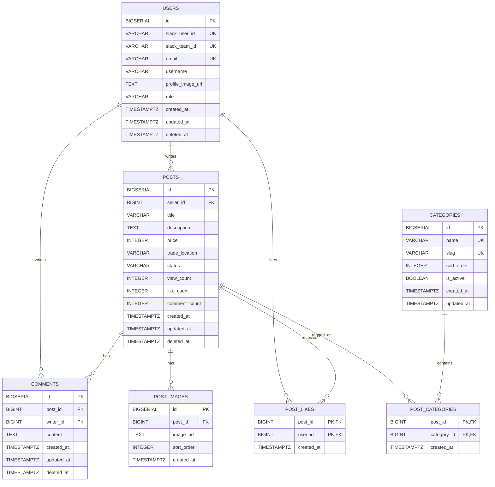

# DB Schema

## 1. 문서 목적

이 문서는 Jungle Market 서비스의 PostgreSQL 데이터베이스 구조를 정의한다.

본 문서는 다음 작업의 기준으로 사용한다.

- FastAPI 모델 설계
- SQLAlchemy ORM 모델 작성
- Alembic 마이그레이션 작성
- API 요청/응답 구조 설계
- ERD 작성
- 데이터 무결성 검토

## 2. 설계 기준

Jungle Market은 Slack 로그인을 사용하는 내부 중고거래 게시판이다.

따라서 DB 설계는 다음 기준을 따른다.

| 기준             | 설명                            |
| ---------------- | ------------------------------- |
| DBMS             | PostgreSQL                      |
| 인증 방식        | Slack OAuth 로그인              |
| 사용자 식별 기준 | `slack_team_id + slack_user_id` |
| 게시글 삭제 방식 | soft delete, `deleted_at` 사용  |
| 시간 타입        | `TIMESTAMPTZ` 사용              |
| 기본 PK 타입     | `BIGSERIAL` 사용                |
| 금액 타입        | MVP에서는 `INTEGER` 사용        |
| 관계 표현        | 1:N, N:1, N:M 기준으로 명시     |

## 3. 명명 규칙

| 구분      | 규칙              | 예시                                 |
| --------- | ----------------- | ------------------------------------ |
| 테이블명  | 소문자 복수형     | `users`, `posts`                     |
| 컬럼명    | snake_case        | `created_at`, `seller_id`            |
| PK 컬럼   | `id`              | `users.id`                           |
| FK 컬럼   | 참조 대상 + `_id` | `seller_id`, `post_id`               |
| 생성 시각 | `created_at`      | `TIMESTAMPTZ NOT NULL DEFAULT now()` |
| 수정 시각 | `updated_at`      | `TIMESTAMPTZ NOT NULL DEFAULT now()` |
| 삭제 시각 | `deleted_at`      | `TIMESTAMPTZ NULL`                   |

## 4. 테이블 요약

| 테이블            | 역할                   |
| ----------------- | ---------------------- |
| `users`           | Slack 로그인 사용자    |
| `posts`           | 중고거래 게시글        |
| `categories`      | 게시글 카테고리        |
| `post_categories` | 게시글과 카테고리 연결 |
| `post_likes`      | 게시글 좋아요          |
| `comments`        | 게시글 댓글            |
| `post_images`     | 게시글 이미지          |

## 5. 테이블 상세

## 5.1 users

Slack 로그인을 통해 가입한 사용자 정보를 저장한다.

비밀번호 로그인은 사용하지 않으므로 `password_hash` 컬럼은 두지 않는다.

| 컬럼                | 타입           | 필수 | 기본값   | 설명                  |
| ------------------- | -------------- | ---- | -------- | --------------------- |
| `id`                | `BIGSERIAL`    | Yes  |          | 사용자 PK             |
| `slack_user_id`     | `VARCHAR(50)`  | Yes  |          | Slack 사용자 ID       |
| `slack_team_id`     | `VARCHAR(50)`  | Yes  |          | Slack 워크스페이스 ID |
| `email`             | `VARCHAR(255)` | Yes  |          | Slack 계정 이메일     |
| `username`          | `VARCHAR(50)`  | Yes  |          | 화면에 표시할 이름    |
| `profile_image_url` | `TEXT`         | No   |          | 프로필 이미지 URL     |
| `role`              | `VARCHAR(20)`  | Yes  | `'user'` | 사용자 권한           |
| `created_at`        | `TIMESTAMPTZ`  | Yes  | `now()`  | 가입 시각             |
| `updated_at`        | `TIMESTAMPTZ`  | Yes  | `now()`  | 수정 시각             |
| `deleted_at`        | `TIMESTAMPTZ`  | No   |          | 탈퇴 또는 삭제 시각   |

### users 제약조건

| 제약조건                                | 내용                             | 이유                                 |
| --------------------------------------- | -------------------------------- | ------------------------------------ |
| `PRIMARY KEY (id)`                      | 사용자 고유 식별자               | 내부 FK 참조 기준                    |
| `UNIQUE (slack_team_id, slack_user_id)` | 같은 Slack 사용자 중복 가입 방지 | Slack 사용자의 실제 로그인 식별 기준 |
| `UNIQUE (email)`                        | 이메일 중복 방지                 | 같은 이메일로 여러 계정 생성 방지    |
| `CHECK (role IN ('user', 'admin'))`     | 권한 값 제한                     | 잘못된 role 저장 방지                |

### users 설계 근거

- Slack 사용자는 이메일보다 `slack_team_id + slack_user_id` 조합으로 식별하는 것이 안정적이다.
- 이메일은 로그인 보조 정보와 사용자 표시 정보로 사용한다.
- `deleted_at`을 두면 사용자를 바로 삭제하지 않고, 작성글과 댓글 이력을 보존할 수 있다.

## 5.2 posts

중고거래 게시글 정보를 저장한다.

`seller_id`는 게시글 작성자이자 판매자를 의미한다.

| 컬럼             | 타입          | 필수 | 기본값      | 설명           |
| ---------------- | ------------- | ---- | ----------- | -------------- |
| `id`             | `BIGSERIAL`   | Yes  |             | 게시글 PK      |
| `seller_id`      | `BIGINT`      | Yes  |             | 판매자 ID      |
| `title`          | `VARCHAR(80)` | Yes  |             | 게시글 제목    |
| `description`    | `TEXT`        | No   |             | 게시글 설명    |
| `price`          | `INTEGER`     | Yes  |             | 판매 가격      |
| `trade_location` | `VARCHAR(40)` | Yes  |             | 거래 희망 장소 |
| `status`         | `VARCHAR(20)` | Yes  | `'selling'` | 판매 상태      |
| `view_count`     | `INTEGER`     | Yes  | `0`         | 조회 수        |
| `like_count`     | `INTEGER`     | Yes  | `0`         | 좋아요 수      |
| `comment_count`  | `INTEGER`     | Yes  | `0`         | 댓글 수        |
| `created_at`     | `TIMESTAMPTZ` | Yes  | `now()`     | 작성 시각      |
| `updated_at`     | `TIMESTAMPTZ` | Yes  | `now()`     | 수정 시각      |
| `deleted_at`     | `TIMESTAMPTZ` | No   |             | 삭제 시각      |

### posts 제약조건

| 제약조건                                            | 내용                             | 이유                                |
| --------------------------------------------------- | -------------------------------- | ----------------------------------- |
| `PRIMARY KEY (id)`                                  | 게시글 고유 식별자               | 게시글 상세, 댓글, 이미지 참조 기준 |
| `FOREIGN KEY (seller_id) REFERENCES users(id)`      | 게시글은 한 명의 판매자를 가진다 | 존재하지 않는 사용자의 게시글 방지  |
| `CHECK (price >= 0)`                                | 가격은 0원 이상                  | 무료 나눔 허용, 음수 가격 방지      |
| `CHECK (status IN ('selling', 'reserved', 'sold'))` | 판매 상태 제한                   | 상태값 오염 방지                    |
| `CHECK (view_count >= 0)`                           | 조회 수 0 이상                   | 통계값 무결성                       |
| `CHECK (like_count >= 0)`                           | 좋아요 수 0 이상                 | 통계값 무결성                       |
| `CHECK (comment_count >= 0)`                        | 댓글 수 0 이상                   | 통계값 무결성                       |

### posts 설계 근거

- 게시글은 반드시 판매자를 가져야 하므로 `seller_id`는 `NOT NULL`이다.
- `description`은 사용자가 간단히 제목, 가격, 위치만 입력할 수도 있으므로 필수로 두지 않는다.
- `view_count`, `like_count`, `comment_count`는 목록 조회 성능을 위해 캐시성 컬럼으로 둔다.
- 캐시성 카운트 컬럼은 실제 댓글/좋아요 데이터와 동기화 전략이 필요하다.

## 5.3 categories

게시글 카테고리 정보를 저장한다.

| 컬럼         | 타입          | 필수 | 기본값  | 설명                            |
| ------------ | ------------- | ---- | ------- | ------------------------------- |
| `id`         | `BIGSERIAL`   | Yes  |         | 카테고리 PK                     |
| `name`       | `VARCHAR(50)` | Yes  |         | 화면 표시 이름                  |
| `slug`       | `VARCHAR(50)` | Yes  |         | URL 또는 코드에서 사용할 식별값 |
| `sort_order` | `INTEGER`     | Yes  | `0`     | 정렬 순서                       |
| `is_active`  | `BOOLEAN`     | Yes  | `true`  | 사용 여부                       |
| `created_at` | `TIMESTAMPTZ` | Yes  | `now()` | 생성 시각                       |
| `updated_at` | `TIMESTAMPTZ` | Yes  | `now()` | 수정 시각                       |

### categories 제약조건

| 제약조건                  | 내용                    | 이유                  |
| ------------------------- | ----------------------- | --------------------- |
| `PRIMARY KEY (id)`        | 카테고리 고유 식별자    | FK 참조 기준          |
| `UNIQUE (name)`           | 카테고리 이름 중복 방지 | 사용자 화면 혼란 방지 |
| `UNIQUE (slug)`           | slug 중복 방지          | API, URL 식별 안정성  |
| `CHECK (sort_order >= 0)` | 정렬 순서 0 이상        | 잘못된 정렬값 방지    |

### categories 설계 근거

- `name`은 사용자에게 보이는 값이다. 예: 전자기기
- `slug`는 시스템에서 쓰는 값이다. 예: electronics
- `is_active`를 두면 기존 게시글 데이터는 유지하면서 특정 카테고리만 숨길 수 있다.

## 5.4 post_categories

게시글과 카테고리의 연결 정보를 저장한다.

현재 MVP에서 게시글당 카테고리를 1개만 허용하더라도, 이 구조를 사용하면 나중에 다중 카테고리로 확장하기 쉽다.

| 컬럼          | 타입          | 필수 | 기본값  | 설명           |
| ------------- | ------------- | ---- | ------- | -------------- |
| `post_id`     | `BIGINT`      | Yes  |         | 게시글 ID      |
| `category_id` | `BIGINT`      | Yes  |         | 카테고리 ID    |
| `created_at`  | `TIMESTAMPTZ` | Yes  | `now()` | 연결 생성 시각 |

### post_categories 제약조건

| 제약조건                                                       | 내용                                | 이유                      |
| -------------------------------------------------------------- | ----------------------------------- | ------------------------- |
| `PRIMARY KEY (post_id, category_id)`                           | 같은 게시글-카테고리 연결 중복 방지 | 중복 매핑 방지            |
| `FOREIGN KEY (post_id) REFERENCES posts(id) ON DELETE CASCADE` | 게시글 삭제 시 연결 정보 삭제       | 고아 데이터 방지          |
| `FOREIGN KEY (category_id) REFERENCES categories(id)`          | 존재하는 카테고리만 연결            | 잘못된 카테고리 참조 방지 |

## 5.5 post_likes

사용자가 좋아요한 게시글 정보를 저장한다.

| 컬럼         | 타입          | 필수 | 기본값  | 설명             |
| ------------ | ------------- | ---- | ------- | ---------------- |
| `post_id`    | `BIGINT`      | Yes  |         | 게시글 ID        |
| `user_id`    | `BIGINT`      | Yes  |         | 사용자 ID        |
| `created_at` | `TIMESTAMPTZ` | Yes  | `now()` | 좋아요 생성 시각 |

### post_likes 제약조건

| 제약조건                                                       | 내용                                         | 이유                    |
| -------------------------------------------------------------- | -------------------------------------------- | ----------------------- |
| `PRIMARY KEY (post_id, user_id)`                               | 같은 게시글에 같은 사용자가 중복 좋아요 불가 | 좋아요 중복 방지        |
| `FOREIGN KEY (post_id) REFERENCES posts(id) ON DELETE CASCADE` | 게시글 삭제 시 좋아요 삭제                   | 고아 데이터 방지        |
| `FOREIGN KEY (user_id) REFERENCES users(id)`                   | 존재하는 사용자만 좋아요 가능                | 잘못된 사용자 참조 방지 |

## 5.6 comments

게시글 댓글 정보를 저장한다.

현재 댓글은 공개 댓글을 기준으로 한다. 비밀 댓글 기능이 필요하면 `is_secret BOOLEAN NOT NULL DEFAULT false` 컬럼을 추가할 수 있다.

| 컬럼         | 타입          | 필수 | 기본값  | 설명           |
| ------------ | ------------- | ---- | ------- | -------------- |
| `id`         | `BIGSERIAL`   | Yes  |         | 댓글 PK        |
| `post_id`    | `BIGINT`      | Yes  |         | 게시글 ID      |
| `writer_id`  | `BIGINT`      | Yes  |         | 댓글 작성자 ID |
| `content`    | `TEXT`        | Yes  |         | 댓글 내용      |
| `created_at` | `TIMESTAMPTZ` | Yes  | `now()` | 작성 시각      |
| `updated_at` | `TIMESTAMPTZ` | Yes  | `now()` | 수정 시각      |
| `deleted_at` | `TIMESTAMPTZ` | No   |         | 삭제 시각      |

### comments 제약조건

| 제약조건                                                       | 내용                           | 이유                      |
| -------------------------------------------------------------- | ------------------------------ | ------------------------- |
| `PRIMARY KEY (id)`                                             | 댓글 고유 식별자               | 댓글 수정, 삭제 기준      |
| `FOREIGN KEY (post_id) REFERENCES posts(id) ON DELETE CASCADE` | 댓글은 하나의 게시글에 속한다  | 게시글 삭제 시 댓글 정리  |
| `FOREIGN KEY (writer_id) REFERENCES users(id)`                 | 댓글은 한 명의 작성자를 가진다 | 존재하지 않는 작성자 방지 |
| `CHECK (length(trim(content)) > 0)`                            | 빈 댓글 저장 방지              | 의미 없는 데이터 방지     |

## 5.7 post_images

게시글 이미지 정보를 저장한다.

실제 이미지 파일은 DB에 저장하지 않고, 파일 저장소의 URL만 저장한다.

| 컬럼         | 타입          | 필수 | 기본값  | 설명             |
| ------------ | ------------- | ---- | ------- | ---------------- |
| `id`         | `BIGSERIAL`   | Yes  |         | 이미지 PK        |
| `post_id`    | `BIGINT`      | Yes  |         | 게시글 ID        |
| `image_url`  | `TEXT`        | Yes  |         | 이미지 URL       |
| `sort_order` | `INTEGER`     | Yes  | `0`     | 이미지 표시 순서 |
| `created_at` | `TIMESTAMPTZ` | Yes  | `now()` | 생성 시각        |

### post_images 제약조건

| 제약조건                                                       | 내용                            | 이유                            |
| -------------------------------------------------------------- | ------------------------------- | ------------------------------- |
| `PRIMARY KEY (id)`                                             | 이미지 고유 식별자              | 이미지 삭제 기준                |
| `FOREIGN KEY (post_id) REFERENCES posts(id) ON DELETE CASCADE` | 이미지는 하나의 게시글에 속한다 | 게시글 삭제 시 이미지 정보 정리 |
| `CHECK (sort_order >= 0)`                                      | 표시 순서 0 이상                | 잘못된 정렬값 방지              |

## 6. 관계 정의

## 6.1 관계 요약

| From              | 관계 | To                | 설명                                                |
| ----------------- | ---- | ----------------- | --------------------------------------------------- |
| `users`           | 1:N  | `posts`           | 한 사용자는 여러 게시글을 작성할 수 있다.           |
| `users`           | 1:N  | `comments`        | 한 사용자는 여러 댓글을 작성할 수 있다.             |
| `users`           | 1:N  | `post_likes`      | 한 사용자는 여러 게시글에 좋아요를 누를 수 있다.    |
| `posts`           | N:1  | `users`           | 한 게시글은 한 명의 판매자를 가진다.                |
| `posts`           | 1:N  | `comments`        | 한 게시글은 여러 댓글을 가질 수 있다.               |
| `posts`           | 1:N  | `post_images`     | 한 게시글은 여러 이미지를 가질 수 있다.             |
| `posts`           | 1:N  | `post_likes`      | 한 게시글은 여러 좋아요를 받을 수 있다.             |
| `posts`           | 1:N  | `post_categories` | 한 게시글은 여러 카테고리 연결 정보를 가질 수 있다. |
| `categories`      | 1:N  | `post_categories` | 한 카테고리는 여러 게시글과 연결될 수 있다.         |
| `post_categories` | N:1  | `posts`           | 하나의 연결 정보는 하나의 게시글을 참조한다.        |
| `post_categories` | N:1  | `categories`      | 하나의 연결 정보는 하나의 카테고리를 참조한다.      |
| `post_likes`      | N:1  | `users`           | 하나의 좋아요는 한 사용자가 만든다.                 |
| `post_likes`      | N:1  | `posts`           | 하나의 좋아요는 한 게시글에 속한다.                 |
| `comments`        | N:1  | `users`           | 하나의 댓글은 한 사용자가 작성한다.                 |
| `comments`        | N:1  | `posts`           | 하나의 댓글은 한 게시글에 속한다.                   |
| `post_images`     | N:1  | `posts`           | 하나의 이미지는 한 게시글에 속한다.                 |

## 6.2 Mermaid ERD



## 7. PostgreSQL DDL 초안

아래 SQL은 실제 마이그레이션 작성 전 참고용 초안이다.

```sql
CREATE TABLE users (
    id BIGSERIAL PRIMARY KEY,
    slack_user_id VARCHAR(50) NOT NULL,
    slack_team_id VARCHAR(50) NOT NULL,
    email VARCHAR(255) NOT NULL,
    username VARCHAR(50) NOT NULL,
    profile_image_url TEXT,
    role VARCHAR(20) NOT NULL DEFAULT 'user',
    created_at TIMESTAMPTZ NOT NULL DEFAULT now(),
    updated_at TIMESTAMPTZ NOT NULL DEFAULT now(),
    deleted_at TIMESTAMPTZ,
    CONSTRAINT uq_users_slack_identity UNIQUE (slack_team_id, slack_user_id),
    CONSTRAINT uq_users_email UNIQUE (email),
    CONSTRAINT ck_users_role CHECK (role IN ('user', 'admin'))
);

CREATE TABLE posts (
    id BIGSERIAL PRIMARY KEY,
    seller_id BIGINT NOT NULL REFERENCES users(id),
    title VARCHAR(80) NOT NULL,
    description TEXT,
    price INTEGER NOT NULL,
    trade_location VARCHAR(40) NOT NULL,
    status VARCHAR(20) NOT NULL DEFAULT 'selling',
    view_count INTEGER NOT NULL DEFAULT 0,
    like_count INTEGER NOT NULL DEFAULT 0,
    comment_count INTEGER NOT NULL DEFAULT 0,
    created_at TIMESTAMPTZ NOT NULL DEFAULT now(),
    updated_at TIMESTAMPTZ NOT NULL DEFAULT now(),
    deleted_at TIMESTAMPTZ,
    CONSTRAINT ck_posts_price CHECK (price >= 0),
    CONSTRAINT ck_posts_status CHECK (status IN ('selling', 'reserved', 'sold')),
    CONSTRAINT ck_posts_view_count CHECK (view_count >= 0),
    CONSTRAINT ck_posts_like_count CHECK (like_count >= 0),
    CONSTRAINT ck_posts_comment_count CHECK (comment_count >= 0)
);

CREATE TABLE categories (
    id BIGSERIAL PRIMARY KEY,
    name VARCHAR(50) NOT NULL,
    slug VARCHAR(50) NOT NULL,
    sort_order INTEGER NOT NULL DEFAULT 0,
    is_active BOOLEAN NOT NULL DEFAULT true,
    created_at TIMESTAMPTZ NOT NULL DEFAULT now(),
    updated_at TIMESTAMPTZ NOT NULL DEFAULT now(),
    CONSTRAINT uq_categories_name UNIQUE (name),
    CONSTRAINT uq_categories_slug UNIQUE (slug),
    CONSTRAINT ck_categories_sort_order CHECK (sort_order >= 0)
);

CREATE TABLE post_categories (
    post_id BIGINT NOT NULL REFERENCES posts(id) ON DELETE CASCADE,
    category_id BIGINT NOT NULL REFERENCES categories(id),
    created_at TIMESTAMPTZ NOT NULL DEFAULT now(),
    PRIMARY KEY (post_id, category_id)
);

CREATE TABLE post_likes (
    post_id BIGINT NOT NULL REFERENCES posts(id) ON DELETE CASCADE,
    user_id BIGINT NOT NULL REFERENCES users(id),
    created_at TIMESTAMPTZ NOT NULL DEFAULT now(),
    PRIMARY KEY (post_id, user_id)
);

CREATE TABLE comments (
    id BIGSERIAL PRIMARY KEY,
    post_id BIGINT NOT NULL REFERENCES posts(id) ON DELETE CASCADE,
    writer_id BIGINT NOT NULL REFERENCES users(id),
    content TEXT NOT NULL,
    created_at TIMESTAMPTZ NOT NULL DEFAULT now(),
    updated_at TIMESTAMPTZ NOT NULL DEFAULT now(),
    deleted_at TIMESTAMPTZ,
    CONSTRAINT ck_comments_content CHECK (length(trim(content)) > 0)
);

CREATE TABLE post_images (
    id BIGSERIAL PRIMARY KEY,
    post_id BIGINT NOT NULL REFERENCES posts(id) ON DELETE CASCADE,
    image_url TEXT NOT NULL,
    sort_order INTEGER NOT NULL DEFAULT 0,
    created_at TIMESTAMPTZ NOT NULL DEFAULT now(),
    CONSTRAINT ck_post_images_sort_order CHECK (sort_order >= 0)
);
```

## 8. 인덱스 권장사항

| 인덱스             | SQL 예시                                                                        | 목적                      |
| ------------------ | ------------------------------------------------------------------------------- | ------------------------- |
| Slack 사용자 조회  | `CREATE INDEX idx_users_slack_identity ON users(slack_team_id, slack_user_id);` | 로그인 시 사용자 조회     |
| 게시글 최신순 조회 | `CREATE INDEX idx_posts_created_at ON posts(created_at DESC);`                  | 메인 목록 최신순          |
| 판매중 게시글 조회 | `CREATE INDEX idx_posts_status_created_at ON posts(status, created_at DESC);`   | 판매중 필터               |
| 판매자 게시글 조회 | `CREATE INDEX idx_posts_seller_id ON posts(seller_id);`                         | 마이페이지 내 글 목록     |
| 게시글 댓글 조회   | `CREATE INDEX idx_comments_post_id ON comments(post_id);`                       | 상세 페이지 댓글 목록     |
| 게시글 이미지 조회 | `CREATE INDEX idx_post_images_post_id ON post_images(post_id);`                 | 상세 페이지 이미지 목록   |
| 사용자 좋아요 조회 | `CREATE INDEX idx_post_likes_user_id ON post_likes(user_id);`                   | 사용자가 좋아요한 글 조회 |

## 9. 실무 관점 검토사항

## 9.1 BIGSERIAL 사용 여부

현재 문서는 `BIGSERIAL`을 기준으로 작성했다.

PostgreSQL 최신 스타일에서는 다음처럼 `IDENTITY` 문법을 사용할 수도 있다.

```sql
id BIGINT GENERATED BY DEFAULT AS IDENTITY PRIMARY KEY
```

MVP에서는 `BIGSERIAL`도 충분히 사용 가능하다.

## 9.2 카테고리 구조

현재 설계는 `post_categories`를 사용한다.

장점은 다음과 같다.

- 게시글 1개에 카테고리 1개만 붙이는 것도 가능하다.
- 나중에 게시글 1개에 여러 카테고리를 붙이는 것도 가능하다.

단점은 다음과 같다.

- 단순 MVP에서는 `posts.category_id` 하나만 두는 방식보다 테이블이 하나 더 많다.

## 9.3 카운트 컬럼

`like_count`, `comment_count`, `view_count`는 조회 성능을 위해 둔 컬럼이다.

다만 실제 좋아요, 댓글 데이터와 숫자가 어긋나지 않도록 다음 중 하나의 전략이 필요하다.

- 애플리케이션 코드에서 좋아요/댓글 생성 시 함께 증가
- DB 트리거 사용
- 일정 주기로 재계산

MVP에서는 애플리케이션 코드에서 함께 갱신하는 방식이 가장 단순하다.

## 9.4 Soft Delete

`users`, `posts`, `comments`에는 `deleted_at`을 둔다.

이 방식은 데이터를 바로 삭제하지 않고 삭제 시각만 기록한다.

장점은 다음과 같다.

- 운영자가 문제 상황을 추적할 수 있다.
- 댓글, 게시글 이력을 일정 기간 보존할 수 있다.
- 실수로 삭제한 데이터를 복구할 여지가 있다.

주의할 점은 다음과 같다.

- 일반 목록 조회에서는 `deleted_at IS NULL` 조건을 반드시 넣어야 한다.

## 10. 추가 결정이 필요한 사항

| 항목               | 선택지                  | 현재 권장                                 |
| ------------------ | ----------------------- | ----------------------------------------- |
| 게시글 카테고리 수 | 1개 / 여러 개           | MVP는 1개, 구조는 확장 가능하게 유지      |
| 댓글 공개 범위     | 공개 댓글 / 비밀 댓글   | MVP는 공개 댓글, 필요 시 `is_secret` 추가 |
| 게시글 상태값      | 영어 코드 / 한글 코드   | 영어 코드 권장                            |
| 이미지 저장소      | 로컬 / S3 / Cloudinary  | MVP는 로컬 또는 Cloudinary                |
| 사용자 탈퇴 처리   | 물리 삭제 / soft delete | soft delete 권장                          |

## 11. 변경 이력

| 날짜       | 작성자 | 내용      |
| ---------- | ------ | --------- |
| 2026-06-11 | 이현성 | 최초 작성 |
