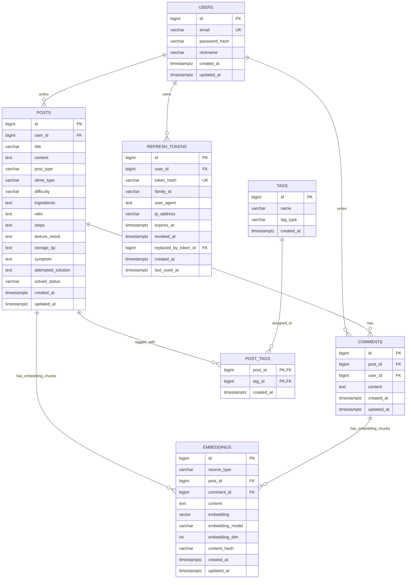

# 말랑 연구소 DB 설계서

## 설계 기준

- 구현 최소 요구사항을 만족하는 필수 테이블 중심 DB 설계다.
- 기본 게시판 기능은 `users`, `posts`, `comments`, `tags`, `post_tags`로 처리한다.
- 로그인 유지는 `refresh_tokens`로 처리하며, refresh token 원문은 저장하지 않고 hash만 저장한다.
- RAG 검색은 `embeddings`에 게시글/댓글 벡터를 저장해서 처리한다.
- MCP와 AI Agent 결과는 웹 페이지에서 재조회하지 않으므로 별도 저장 테이블을 두지 않고 API 응답으로 처리한다.
- 레시피, 실패 사례, 후기 상세값은 별도 상세 테이블로 분리하지 않고 `posts`의 선택 컬럼으로 관리한다.

## 요구사항 반영표

| 요구사항 | DB 반영 | 설명 |
| --- | --- | --- |
| 회원가입 / 로그인 | `users`, `refresh_tokens` | 이메일, 비밀번호 해시, 닉네임, refresh token hash 저장 |
| 게시물 CRUD | `posts` | 게시글 생성, 조회, 수정, 삭제 |
| 댓글 | `comments` | 게시글별 댓글 저장 |
| 태그 | `tags`, `post_tags` | 태그 마스터와 게시글-태그 다대다 연결, 직접 입력 태그 저장 |
| 페이징 | `posts.created_at`, `posts.id` 인덱스 | 최신순 목록 조회 기준 |
| 검색 | `posts`, `tags` | 제목, 본문, 증상, 태그명 기반 키워드 검색과 다중 태그 AND 필터 |
| RAG | `embeddings` | 게시글/댓글을 벡터화해 유사 사례 검색 |
| MCP | 별도 테이블 없음 | MCP 도구 결과는 요청 시 즉시 반환 |
| AI Agent | 별도 테이블 없음 | Agent 답변은 요청 시 즉시 생성해 반환 |

## 테이블 구성

| 테이블 | 역할 | 필수 기능 |
| --- | --- | --- |
| `users` | 회원 계정과 작성자 정보를 저장한다. | 인증, 작성자 표시 |
| `refresh_tokens` | access token 재발급용 refresh token hash를 저장한다. | 로그인 유지, 로그아웃, 토큰 회전 |
| `posts` | 레시피, 실패 질문, 후기, 일반 글을 한 테이블에서 관리한다. | 게시글 CRUD, 검색, 페이징 |
| `comments` | 게시글의 댓글을 저장한다. | 댓글 |
| `tags` | 슬라임 종류, 증상, 질감, 난이도, 목적 태그를 저장한다. | 태그, 검색 필터 |
| `post_tags` | 게시글과 태그의 다대다 관계를 저장한다. | 태그 연결 |
| `embeddings` | 게시글/댓글에서 잘라낸 검색 조각과 벡터를 저장한다. | 게시글 1:N, 댓글 1:N |

## 관계 차수

| 관계 | 차수 | 설명 |
| --- | --- | --- |
| `users` - `posts` | 1:N | 한 사용자는 여러 게시글을 작성할 수 있고, 게시글 하나는 작성자 한 명에 속한다. |
| `users` - `comments` | 1:N | 한 사용자는 여러 댓글을 작성할 수 있고, 댓글 하나는 작성자 한 명에 속한다. |
| `users` - `refresh_tokens` | 1:N | 한 사용자는 여러 로그인 세션을 가질 수 있고, refresh token 하나는 사용자 한 명에 속한다. |
| `posts` - `comments` | 1:N | 한 게시글에는 여러 댓글이 달릴 수 있고, 댓글 하나는 게시글 하나에 속한다. |
| `posts` - `post_tags` | 1:N | 게시글과 태그의 N:M 관계를 조인 테이블의 1:N 관계로 풀어낸다. |
| `tags` - `post_tags` | 1:N | 태그와 게시글의 N:M 관계를 조인 테이블의 1:N 관계로 풀어낸다. |
| `posts` - `embeddings` | 1:N | 게시글 하나는 RAG 검색을 위해 여러 텍스트 조각으로 나뉘어 여러 임베딩을 가질 수 있다. |
| `comments` - `embeddings` | 1:N | 댓글 하나도 여러 텍스트 조각으로 나뉘어 여러 임베딩을 가질 수 있다. |

`embeddings`는 `post_id`와 `comment_id`를 모두 채우지 않는다. 임베딩 한 행은 게시글 기반이거나 댓글 기반이며, 두 FK 중 정확히 하나만 값을 가진다.

## AI 기능 처리 방식

RAG는 게시글과 댓글을 검색해야 하므로 `embeddings`에 벡터를 저장한다. 반면 MCP와 AI Agent는 현재 화면에서 결과를 즉시 보여주는 기능이므로 DB 저장 대상이 아니다.

AI 기능 흐름:

1. 게시글이나 댓글이 생성되면 RAG 검색을 위해 `embeddings`에 원문 조각과 벡터를 저장한다.
2. 사용자가 RAG 검색이나 Agent 요청을 보내면 `embeddings`에서 유사한 게시글/댓글 조각을 찾는다.
3. MCP가 필요한 요청이면 서버가 MCP 도구를 호출하고 결과를 API 응답에 포함한다.
4. Agent는 RAG 결과와 MCP 결과를 조합해 답변을 만들고, 화면에 바로 반환한다.

## 전체 ERD

문서 렌더링 환경에서 Mermaid가 보이지 않을 때도 구조를 바로 확인할 수 있도록 PNG 이미지를 함께 둔다.
테이블 생성 SQL은 [`db_schema_sql.md`](db_schema_sql.md)에 따로 정리한다.

## 테이블 상세

### `users`

회원 인증과 작성자 표시를 위한 계정 테이블이다.

| 컬럼 | 타입 | 제약 | 설명 |
| --- | --- | --- | --- |
| `id` | `bigint` | PK | 사용자 식별자 |
| `email` | `varchar(255)` | NOT NULL, UNIQUE, INDEX | 로그인 이메일 |
| `password_hash` | `varchar(255)` | NOT NULL | 해시 처리된 비밀번호 |
| `nickname` | `varchar(80)` | NOT NULL | 화면 표시 이름 |
| `created_at` | `timestamptz` | DEFAULT now | 가입 일시 |
| `updated_at` | `timestamptz` | DEFAULT now, ON UPDATE | 수정 일시 |

### `refresh_tokens`

access token이 만료됐을 때 로그인 상태를 이어가기 위한 토큰 저장 테이블이다. refresh token 원문은 DB에 저장하지 않고, 해시만 저장한다.

| 컬럼 | 타입 | 제약 | 설명 |
| --- | --- | --- | --- |
| `id` | `bigint` | PK | refresh token 식별자 |
| `user_id` | `bigint` | FK, NOT NULL, INDEX | 토큰 소유 사용자 |
| `token_hash` | `varchar(255)` | NOT NULL, UNIQUE | refresh token 원문을 해시한 값 |
| `family_id` | `varchar(64)` | NOT NULL, INDEX | 같은 로그인 흐름에서 회전된 토큰 묶음 |
| `user_agent` | `text` | NULL | 선택 저장: 로그인한 클라이언트 정보 |
| `ip_address` | `varchar(45)` | NULL | 선택 저장: IPv4/IPv6 주소 |
| `expires_at` | `timestamptz` | NOT NULL, INDEX | refresh token 만료 시각 |
| `revoked_at` | `timestamptz` | NULL | 로그아웃, 회전, 탈취 의심으로 폐기된 시각 |
| `replaced_by_token_id` | `bigint` | FK, NULL | 회전 후 새 refresh token id |
| `created_at` | `timestamptz` | DEFAULT now | 생성 일시 |
| `last_used_at` | `timestamptz` | NULL | 마지막 재발급 사용 시각 |

운영 규칙:

- 로그인 시 refresh token을 생성하고 hash만 저장한다.
- `/auth/refresh` 성공 시 기존 refresh token을 `revoked_at` 처리하고 새 token으로 회전한다.
- 이미 revoked된 refresh token이 다시 사용되면 재사용 공격 가능성으로 보고 같은 `family_id`의 토큰을 모두 폐기할 수 있다.
- 로그아웃 시 현재 refresh token을 revoked 처리한다.

### `posts`

게시글 CRUD, 목록 페이징, 키워드 검색의 중심 테이블이다. 게시글 유형별 상세 데이터는 nullable 컬럼으로 둔다.

| 컬럼 | 타입 | 제약 | 설명 |
| --- | --- | --- | --- |
| `id` | `bigint` | PK | 게시글 식별자 |
| `user_id` | `bigint` | FK, NOT NULL, INDEX | 작성자. `users.id` 참조 |
| `title` | `varchar(200)` | NOT NULL, INDEX | 제목 |
| `content` | `text` | NOT NULL | 본문 |
| `post_type` | `varchar(20)` | NOT NULL, INDEX | `recipe`, `failure`, `review`, `general` |
| `slime_type` | `varchar(80)` | NULL, INDEX | 슬라임 종류 |
| `difficulty` | `varchar(80)` | NULL | 난이도 |
| `ingredients` | `text` | NULL | 레시피 재료 |
| `ratio` | `text` | NULL | 레시피 비율 |
| `steps` | `text` | NULL | 제작 순서 |
| `texture_result` | `text` | NULL | 완성 질감 |
| `storage_tip` | `text` | NULL | 보관 팁 |
| `symptom` | `text` | NULL | 실패 증상 |
| `attempted_solution` | `text` | NULL | 시도한 해결 방법 |
| `solved_status` | `varchar(40)` | NULL | 해결 상태 |
| `created_at` | `timestamptz` | DEFAULT now, INDEX | 작성 일시 |
| `updated_at` | `timestamptz` | DEFAULT now, ON UPDATE | 수정 일시 |

유형별 사용 규칙:

| `post_type` | 주로 사용하는 선택 컬럼 |
| --- | --- |
| `recipe` | `ingredients`, `ratio`, `steps`, `texture_result`, `storage_tip`, `difficulty`, `slime_type` |
| `failure` | `symptom`, `attempted_solution`, `solved_status`, `slime_type` |
| `review` | `texture_result`, `difficulty`, `slime_type` |
| `general` | 공통 컬럼 중심 |

### `comments`

게시글 상세 화면의 댓글을 저장한다. 댓글도 RAG 지식 베이스가 될 수 있으므로 `embeddings.comment_id`와 연결된다.

| 컬럼 | 타입 | 제약 | 설명 |
| --- | --- | --- | --- |
| `id` | `bigint` | PK | 댓글 식별자 |
| `post_id` | `bigint` | FK, NOT NULL, INDEX | 댓글이 달린 게시글 |
| `user_id` | `bigint` | FK, NOT NULL, INDEX | 댓글 작성자 |
| `content` | `text` | NOT NULL | 댓글 내용 |
| `created_at` | `timestamptz` | DEFAULT now | 작성 일시 |
| `updated_at` | `timestamptz` | DEFAULT now, ON UPDATE | 수정 일시 |

### `tags`

검색, 필터, 추천 태그 표시를 위한 태그 마스터 테이블이다. 글쓰기 화면에서 사용자가 직접 추가한 태그도 같은 테이블에 저장한다.

| 컬럼 | 타입 | 제약 | 설명 |
| --- | --- | --- | --- |
| `id` | `bigint` | PK | 태그 식별자 |
| `name` | `varchar(80)` | NOT NULL, INDEX | 태그명 |
| `tag_type` | `varchar(40)` | NOT NULL, INDEX | `slime_type`, `symptom`, `texture`, `difficulty`, `purpose`, `custom` |
| `created_at` | `timestamptz` | DEFAULT now | 생성 일시 |

제약:

- `UNIQUE(name)`
- 직접 입력 태그는 앞의 `#`와 공백을 제거해 정규화한 뒤 저장한다.
- 인기 태그는 `post_tags` 사용 횟수 기준으로 계산한다.

### `post_tags`

게시글과 태그의 다대다 관계를 표현하는 조인 테이블이다.

| 컬럼 | 타입 | 제약 | 설명 |
| --- | --- | --- | --- |
| `post_id` | `bigint` | PK, FK | `posts.id` 참조 |
| `tag_id` | `bigint` | PK, FK | `tags.id` 참조 |
| `created_at` | `timestamptz` | DEFAULT now | 연결 일시 |

### `embeddings`

RAG 검색을 위한 벡터 저장 테이블이다. 게시글과 댓글을 작은 검색 단위로 저장한다.

| 컬럼 | 타입 | 제약 | 설명 |
| --- | --- | --- | --- |
| `id` | `bigint` | PK | 임베딩 식별자 |
| `source_type` | `varchar(20)` | NOT NULL, INDEX | `post`, `comment` |
| `post_id` | `bigint` | FK, NULL | 게시글 기반 임베딩이면 `posts.id` 참조 |
| `comment_id` | `bigint` | FK, NULL | 댓글 기반 임베딩이면 `comments.id` 참조 |
| `content` | `text` | NOT NULL | 임베딩에 사용한 원문 조각 |
| `embedding` | `vector(1536)` | NOT NULL | pgvector 임베딩 값 |
| `embedding_model` | `varchar(100)` | NOT NULL | 임베딩 모델명 |
| `embedding_dim` | `int` | NOT NULL | 벡터 차원 |
| `content_hash` | `varchar(64)` | NOT NULL, INDEX | 재임베딩 판단용 해시 |
| `created_at` | `timestamptz` | DEFAULT now | 생성 일시 |
| `updated_at` | `timestamptz` | DEFAULT now, ON UPDATE | 수정 일시 |

제약:

- `source_type`은 `post`, `comment` 중 하나다.
- `post_id`, `comment_id` 중 정확히 하나만 값이 있어야 한다.
- 같은 조각을 중복 임베딩하지 않도록 `post_id IS NOT NULL`이면 `(post_id, content_hash)`, `comment_id IS NOT NULL`이면 `(comment_id, content_hash)` 기준 partial unique index를 둔다.

## 삭제 및 정합성 정책

- 게시글 삭제 시 댓글과 태그 연결은 cascade 삭제한다.
- 게시글/댓글 삭제 시 관련 임베딩도 cascade 삭제하거나 재색인 작업에서 제거한다.
- RAG 검색 품질을 유지하기 위해 게시글/댓글 수정 시 관련 임베딩을 갱신한다.

## 인덱스 후보

현재 기능에 필요한 인덱스:

- `users(email)`
- `refresh_tokens(token_hash)`
- `refresh_tokens(user_id, expires_at) WHERE revoked_at IS NULL`
- `posts(created_at DESC, id DESC)`
- `posts(user_id, created_at DESC)`
- `posts(post_type, created_at DESC)`
- `posts(slime_type, created_at DESC)`
- `comments(post_id, created_at ASC)`
- `tags(name)`, `tags(tag_type)`
- `post_tags(post_id)`, `post_tags(tag_id, post_id)`
- `embeddings(source_type, post_id)`, `embeddings(source_type, comment_id)`
- `embeddings(content_hash)`
- `embeddings.embedding` HNSW 또는 IVFFLAT vector index

검색 품질을 높일 때 검토할 인덱스:

- `posts.title`, `posts.content`, `posts.symptom` PostgreSQL full-text index
- `comments.content` PostgreSQL full-text index
- `tags.name` trigram 또는 full-text index

## 구현 순서 제안

1. `users`, `posts`, `comments`, `tags`, `post_tags`로 기본 게시판을 완성한다.
2. 게시글/댓글 저장 후 `embeddings`를 생성하거나, 배치 작업으로 재색인한다.
3. MCP와 AI Agent는 DB 저장 없이 API 응답으로 결과를 반환한다.
