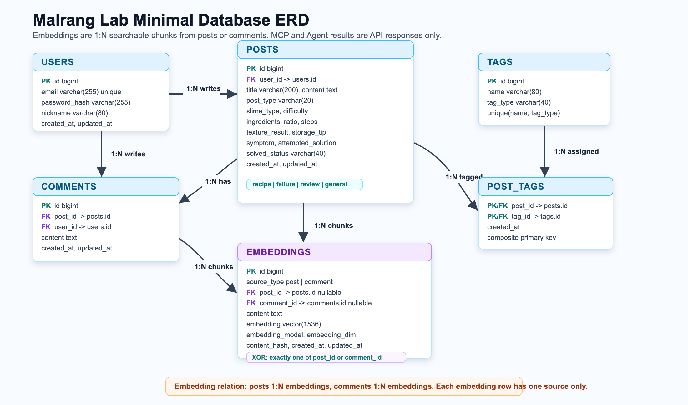
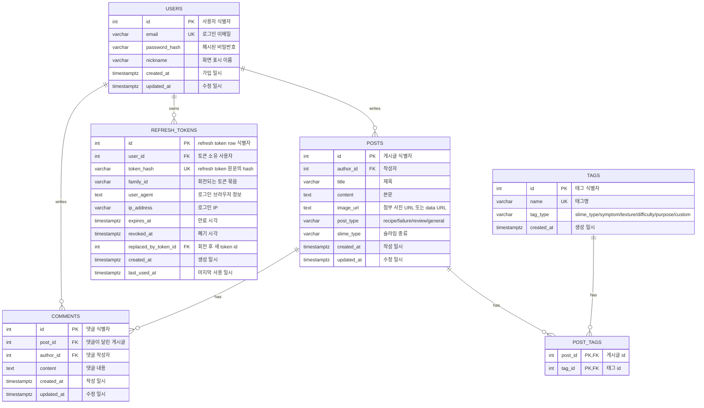

# 말랑 연구소 DB 설계서

## 설계 기준

말랑 연구소의 현재 백엔드는 게시판 기능을 먼저 안정적으로 완성하는 것을 기준으로 설계했다. 그래서 프론트가 실제로 보내는 값과 API가 실제로 사용하는 값만 DB 컬럼으로 둔다.

- 회원가입, 로그인, 로그인 유지는 `users`, `refresh_tokens`가 담당한다.
- 게시글은 `posts` 한 테이블에서 레시피, 실패 질문, 후기, 일반 글을 함께 관리한다.
- 현재 글쓰기 화면은 `title`, `content`, `post_type`, `slime_type`, `image_url`, `tag_names`를 보낸다.
- 예전 설계에 있던 레시피 재료, 비율, 제작 순서, 실패 증상, 해결 상태 같은 상세 필드는 현재 `posts` 테이블에서 제거했다.
- 상세 정보는 지금은 `content` 본문에 작성하고, 나중에 프론트 입력칸이 생기면 DB 컬럼과 API schema를 함께 확장한다.
- 태그는 `tags`에 한 번만 저장하고, 게시글과 태그의 다대다 관계는 `post_tags`로 연결한다.
- RAG/Agent용 `embeddings`는 아직 기본 게시판 구현 범위가 아니므로 현재 ERD에서 제외한다.

## 전체 구조

## 테이블 요약

| 테이블 | 역할 | 핵심 필드 | 연결되는 기능 |
| --- | --- | --- | --- |
| `users` | 회원 계정과 작성자 정보를 저장한다. | `email`, `password_hash`, `nickname` | 회원가입, 로그인, 작성자 표시 |
| `refresh_tokens` | refresh token hash와 회전 이력을 저장한다. | `token_hash`, `family_id`, `expires_at`, `revoked_at` | 로그인 유지, 토큰 재발급, 로그아웃 |
| `posts` | 게시글 본문, 첨부 사진, 분류 정보를 저장한다. | `title`, `content`, `image_url`, `post_type`, `slime_type` | 게시글 목록, 상세, 작성, 수정, 삭제 |
| `comments` | 게시글별 댓글을 저장한다. | `post_id`, `author_id`, `content` | 댓글 목록, 작성, 수정, 삭제 |
| `tags` | 검색과 필터에 쓰는 태그 마스터를 저장한다. | `name`, `tag_type` | 태그 목록, 인기 태그, 직접 입력 태그 |
| `post_tags` | 게시글과 태그의 다대다 관계를 연결한다. | `post_id`, `tag_id` | 다중 태그 필터, 게시글 태그 표시 |

## 관계 설명

| 관계 | 차수 | 설명 |
| --- | --- | --- |
| `users` - `posts` | 1:N | 한 사용자는 여러 게시글을 작성할 수 있고, 게시글 하나는 작성자 한 명에게 속한다. |
| `users` - `comments` | 1:N | 한 사용자는 여러 댓글을 작성할 수 있고, 댓글 하나는 작성자 한 명에게 속한다. |
| `users` - `refresh_tokens` | 1:N | 한 사용자는 여러 로그인 세션을 가질 수 있다. |
| `posts` - `comments` | 1:N | 한 게시글에는 여러 댓글이 달릴 수 있다. 게시글 삭제 시 댓글도 함께 삭제한다. |
| `posts` - `tags` | N:M | 한 게시글은 여러 태그를 가질 수 있고, 한 태그는 여러 게시글에 붙을 수 있다. 이 관계는 `post_tags`로 푼다. |

## 테이블 상세

### `users`

회원 인증과 작성자 표시를 위한 계정 테이블이다.

| 컬럼 | 타입 | 제약 | 설명 |
| --- | --- | --- | --- |
| `id` | `int` | PK, index | 사용자 식별자 |
| `email` | `varchar(255)` | NOT NULL, UNIQUE, index | 로그인 이메일 |
| `password_hash` | `varchar(255)` | NOT NULL | 평문이 아니라 hash 처리된 비밀번호 |
| `nickname` | `varchar(100)` | NOT NULL | 화면에 표시할 사용자 이름 |
| `created_at` | `timestamptz` | DEFAULT now | 가입 일시 |
| `updated_at` | `timestamptz` | DEFAULT now, on update | 사용자 정보 수정 일시 |

### `refresh_tokens`

access token이 만료됐을 때 로그인 상태를 이어가기 위한 테이블이다. refresh token 원문은 DB에 저장하지 않고 `token_hash`만 저장한다.

| 컬럼 | 타입 | 제약 | 설명 |
| --- | --- | --- | --- |
| `id` | `int` | PK, index | refresh token row 식별자 |
| `user_id` | `int` | FK `users.id`, NOT NULL, index | 토큰 소유 사용자 |
| `token_hash` | `varchar(255)` | NOT NULL, UNIQUE, index | refresh token 원문을 hash한 값 |
| `family_id` | `varchar(64)` | NOT NULL, index | 같은 로그인 흐름에서 회전되는 토큰 묶음 |
| `user_agent` | `text` | NULL | 로그인한 브라우저/클라이언트 정보 |
| `ip_address` | `varchar(45)` | NULL | IPv4/IPv6 주소 |
| `expires_at` | `timestamptz` | NOT NULL | refresh token 만료 시각 |
| `revoked_at` | `timestamptz` | NULL | 로그아웃 또는 회전으로 폐기된 시각 |
| `replaced_by_token_id` | `int` | FK `refresh_tokens.id`, NULL | 회전 후 새 refresh token row id |
| `created_at` | `timestamptz` | DEFAULT now | 생성 일시 |
| `last_used_at` | `timestamptz` | NULL | 마지막 재발급 사용 일시 |

운영 흐름:

1. 로그인 성공 시 access token과 refresh token을 함께 발급한다.
2. access token은 응답 body로 내려주고, refresh token 원문은 HttpOnly cookie로 내려준다.
3. DB에는 refresh token 원문이 아니라 hash만 저장한다.
4. `/auth/refresh`가 성공하면 기존 token은 `revoked_at` 처리하고 새 token row를 만든다.
5. 로그아웃하면 현재 refresh token을 폐기하고 cookie를 삭제한다.

### `posts`

게시글 목록, 상세, 작성, 수정, 삭제의 중심 테이블이다. 현재 프로젝트에서는 게시글 유형별 상세 필드를 별도 컬럼으로 나누지 않고 `content` 본문에 저장한다.

| 컬럼 | 타입 | 제약 | 설명 |
| --- | --- | --- | --- |
| `id` | `int` | PK, index | 게시글 식별자 |
| `author_id` | `int` | FK `users.id`, NOT NULL, index | 작성자 |
| `title` | `varchar(200)` | NOT NULL | 게시글 제목 |
| `content` | `text` | NOT NULL | 게시글 본문 |
| `image_url` | `text` | NULL | 첨부 사진 URL 또는 data URL |
| `post_type` | `varchar(20)` | NOT NULL, index | `recipe`, `failure`, `review`, `general` |
| `slime_type` | `varchar(80)` | NULL, index | 선택 입력하는 슬라임 종류 |
| `created_at` | `timestamptz` | DEFAULT now | 작성 일시 |
| `updated_at` | `timestamptz` | DEFAULT now, on update | 수정 일시 |

삭제한 예전 확장 필드:

| 삭제한 필드 | 현재 처리 방식 | 이유 |
| --- | --- | --- |
| `difficulty` | `tags` 또는 `content` | 현재 프론트가 별도 입력값으로 보내지 않음 |
| `ingredients`, `ratio`, `steps` | `content` | 레시피 상세 입력 UI가 아직 없음 |
| `texture_result`, `storage_tip` | `content` | 후기/레시피 상세 입력 UI가 아직 없음 |
| `symptom`, `attempted_solution`, `solved_status` | `content` | 실패 질문 상세 입력 UI가 아직 없음 |

### `comments`

게시글 상세 화면의 댓글을 저장한다.

| 컬럼 | 타입 | 제약 | 설명 |
| --- | --- | --- | --- |
| `id` | `int` | PK, index | 댓글 식별자 |
| `post_id` | `int` | FK `posts.id`, NOT NULL, index | 댓글이 달린 게시글 |
| `author_id` | `int` | FK `users.id`, NOT NULL, index | 댓글 작성자 |
| `content` | `text` | NOT NULL | 댓글 내용 |
| `created_at` | `timestamptz` | DEFAULT now | 작성 일시 |
| `updated_at` | `timestamptz` | DEFAULT now, on update | 수정 일시 |

### `tags`

검색, 필터, 추천 태그 표시를 위한 태그 마스터 테이블이다. 사용자가 직접 입력한 태그도 같은 테이블에 저장하며, 이 경우 `tag_type`은 보통 `custom`이다.

| 컬럼 | 타입 | 제약 | 설명 |
| --- | --- | --- | --- |
| `id` | `int` | PK, index | 태그 식별자 |
| `name` | `varchar(80)` | NOT NULL, UNIQUE, index | 태그명 |
| `tag_type` | `varchar(40)` | NOT NULL, default `custom` | 태그 분류 |
| `created_at` | `timestamptz` | DEFAULT now | 생성 일시 |

### `post_tags`

`posts`와 `tags`의 다대다 관계를 연결하는 중간 테이블이다.

| 컬럼 | 타입 | 제약 | 설명 |
| --- | --- | --- | --- |
| `post_id` | `int` | PK, FK `posts.id` | 게시글 id |
| `tag_id` | `int` | PK, FK `tags.id` | 태그 id |

중간 테이블을 둔 이유:

- 게시글 하나에 태그를 여러 개 붙일 수 있다.
- 태그 하나가 여러 게시글에서 재사용될 수 있다.
- `GET /posts?tags=거품&tags=클리어슬라임`처럼 여러 태그 중 하나라도 포함하는 OR 필터를 구현할 수 있다.
