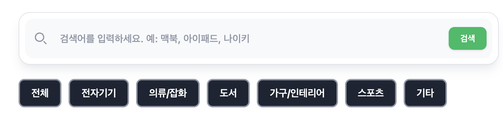
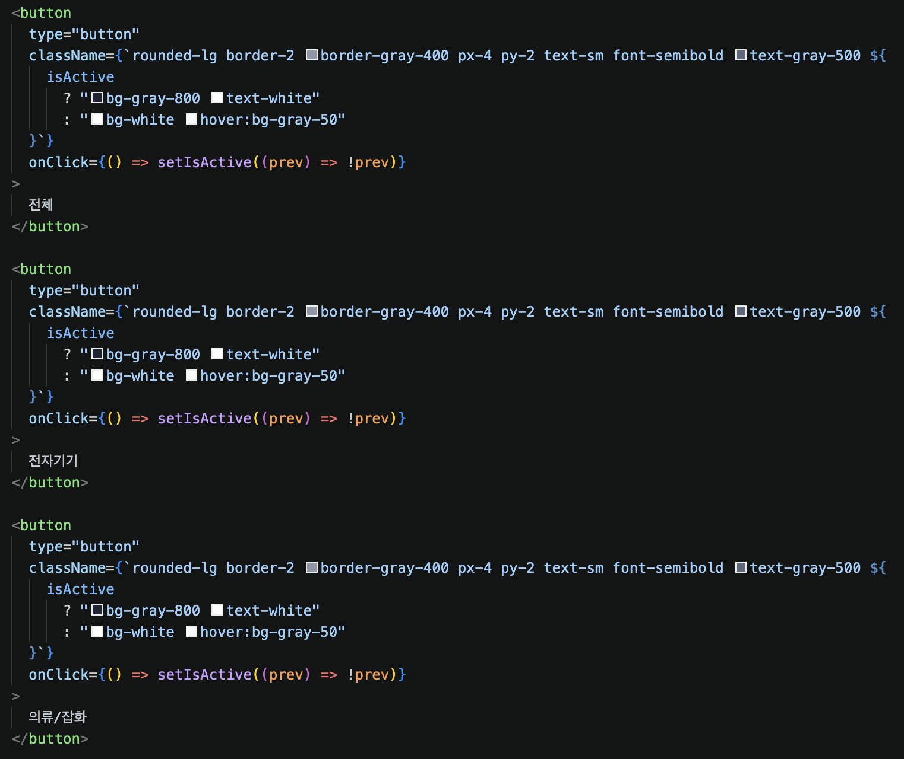
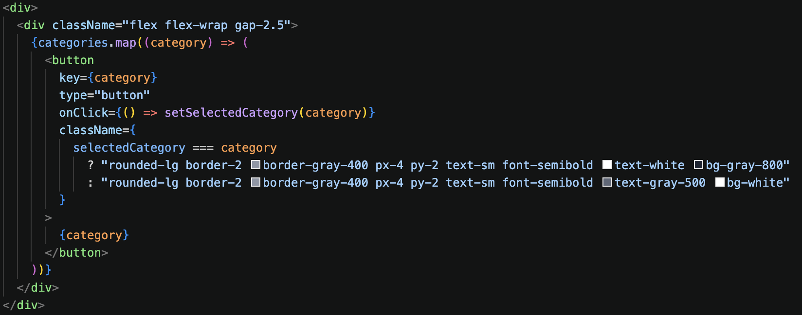

# 카테고리 버튼 활성화 상태가 전체 버튼에 적용되는 문제

## 문제

카테고리 버튼을 눌렀을 때 선택한 버튼 하나만 색상이 바뀌는 것이 아니라, 모든 카테고리 버튼이 활성화 색상으로 바뀌었다.

## 증상

`전자기기` 카테고리 버튼을 클릭했는데, `전자기기`만 활성화되는 것이 아니라 모든 카테고리 버튼이 활성화 색상으로 표시되었다.



## 원인

여러 카테고리 버튼이 동일한 `isActive` state를 공유하고 있었다.

각 버튼별 선택 여부를 구분하지 않고 하나의 boolean 값만 사용했기 때문에, 특정 버튼을 클릭하면 모든 버튼이 같은 활성화 상태로 렌더링되었다.



## 해결 방법

하드 코딩되어 있던 카테고리 버튼을 배열로 관리하고, `map`으로 렌더링하도록 변경했다.

현재 선택된 카테고리는 `selectedCategory` state에 문자열로 저장하고, 각 버튼을 렌더링할 때 해당 버튼의 카테고리 값과 `selectedCategory`를 비교해 스타일을 다르게 적용했다.



## 핵심 코드

```tsx
const [selectedCategory, setSelectedCategory] = useState("전체")

{
  categories.map((category) => (
    <button
      key={category}
      type="button"
      onClick={() => setSelectedCategory(category)}
      className={
        selectedCategory === category
          ? "bg-gray-800 text-white"
          : "bg-white text-gray-500"
      }
    >
      {category}
    </button>
  ))
}
```

## 참고 문서

- [React Docs - Choosing the State Structure](https://react.dev/learn/choosing-the-state-structure)
