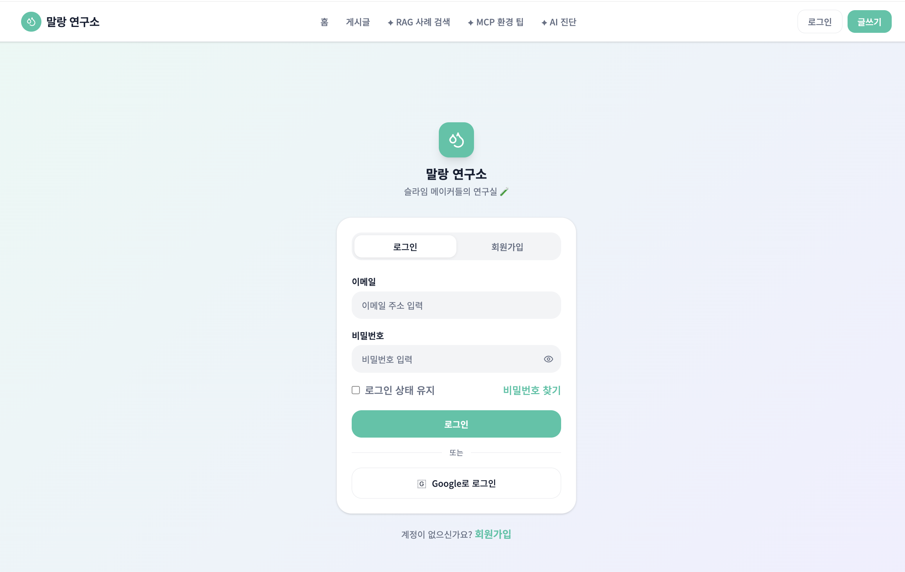
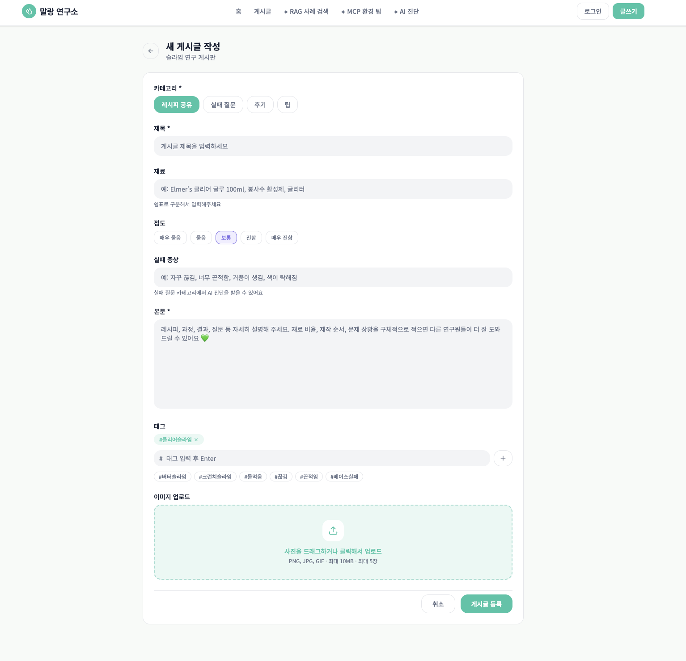

# 말랑 연구소 와이어프레임

현재 프로젝트는 별도 RAG 페이지와 별도 MCP 페이지를 두지 않고, `/agent` 화면에서 내부 게시글 검색 결과와 상품 검색 도구 결과를 함께 보여주는 구조로 축소했다.

## 현재 화면 목록

### 01. 홈

프로젝트 소개, 주요 기능 카드, 최근 게시글, Agent 진입 버튼을 보여준다.

### 02. 게시글 상세

게시글 본문, 작성자 정보, 태그, 댓글, 수정/삭제 액션, Agent 이동 버튼을 보여준다.

### 03. 게시글 목록

검색어, 게시글 유형, 태그 필터, 페이지네이션, 게시글 카드 목록을 보여준다.

### 04. Agent 요청 입력

사용자가 슬라임 제작법, 실패 해결, 재료 구매처를 한 문장으로 입력하는 화면이다.

### 05. Agent RAG 결과

내부 게시글 검색 결과를 근거 카드로 보여준다. 게시글 제목, 유형, 점수, 발췌문, 태그가 핵심 정보다.

### 06. MCP 상품 검색 결과

슬라임 재료별 검색 키워드, 예상 가격대, 쇼핑 검색 링크를 보여준다.

### 07. Agent 통합 결과

선택된 route(`RAG`, `MCP`, `RAG + MCP`), 사용한 도구, 최종 답변, 추천 태그를 보여준다.

### 08. 로그인

인증 폼의 중앙 정렬과 입력 필드 밀도를 확인한다.

### 09. 회원가입

로그인 화면과 동일한 인증 폼 패턴을 사용한다.

### 10. 게시글 작성 / 수정

게시글 유형, 제목, 본문, 슬라임 종류, 난이도, 유형별 선택 필드, 태그 선택을 보여준다.

## 현재 디자인 메모

- 전체 톤은 clean lab mint 방향을 유지한다.
- 넓은 면은 `Background #F7FAF8`, `Surface #FFFFFF`, `Soft Mint #E9F8F4`를 중심으로 사용한다.
- 태그와 카테고리 칩은 기본적으로 흰 배경과 옅은 라인을 사용하고, 선택된 칩만 민트 계열로 강조한다.
- Agent 화면은 RAG, MCP, 통합 결과를 카드 단위로 나누되, 과한 장식보다 정보 스캔이 쉬운 구성을 우선한다.
- MCP는 상품 검색과 구매처 안내 흐름으로 표현한다.
