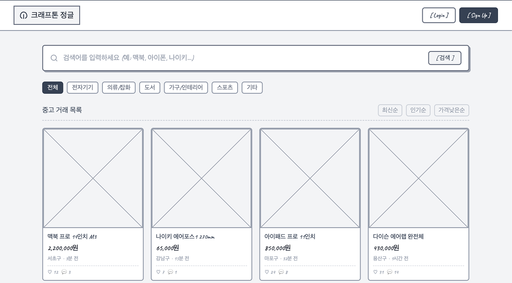
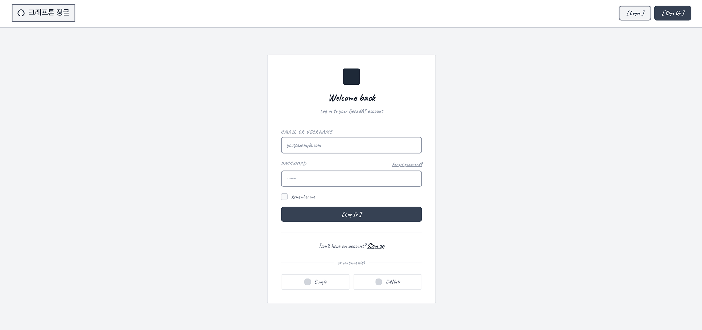
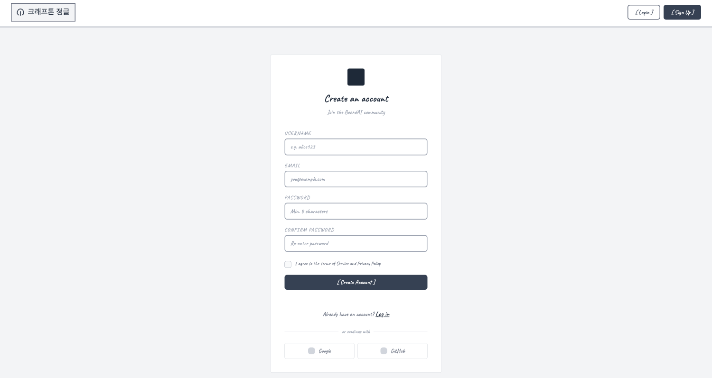
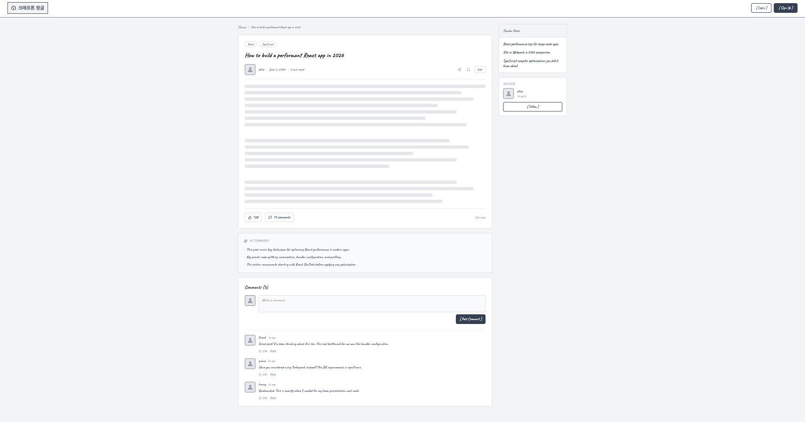
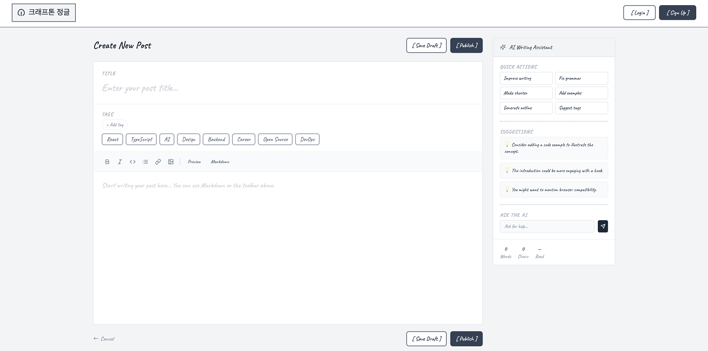
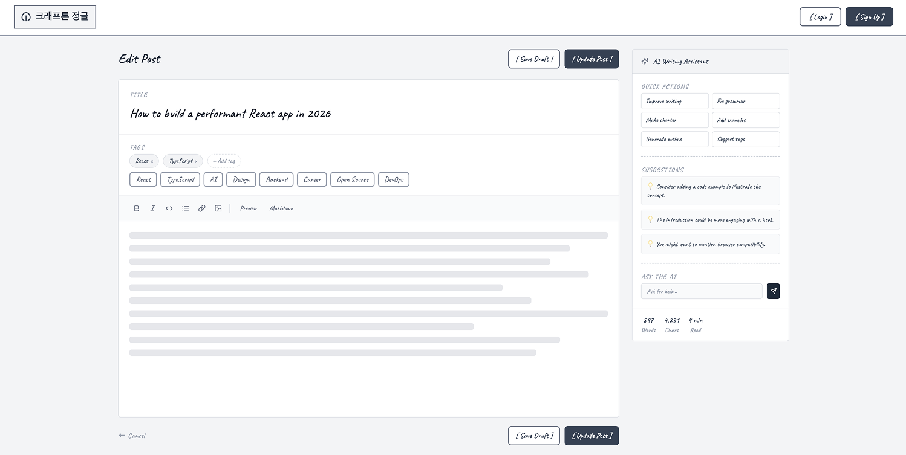
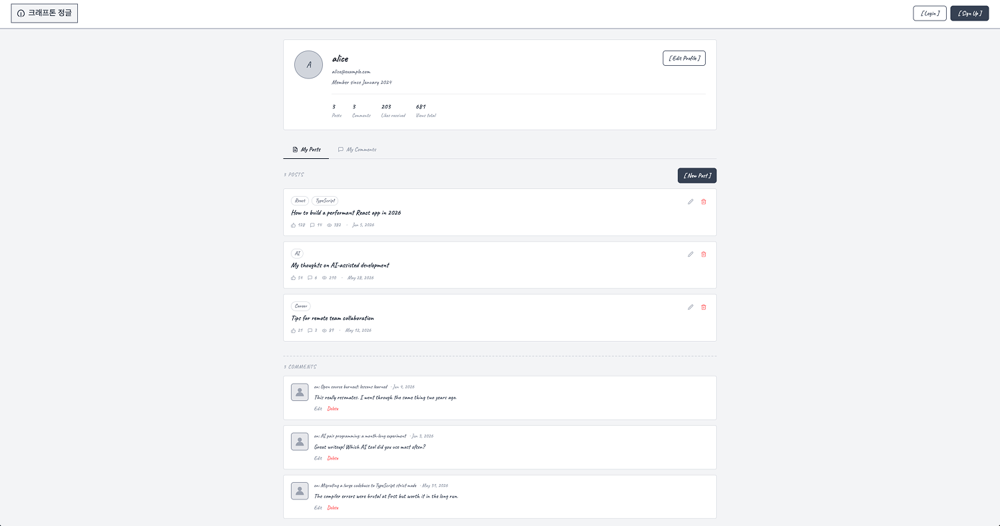

# Wireframe

이 문서는 Figma Make로 제작한 와이어프레임 PNG를 기준으로 페이지 구조를 정리한다.

## Page List

| Page | Route | Image |
| --- | --- | --- |
| Home | `/` | [home.png](./images/home.png) |
| Login | `/login` | [login.png](./images/login.png) |
| Post Detail | `/post-details/:postId` | [post-detail.png](./images/post-detail.png) |
| Create Post | `/post-create` | [post-create.png](./images/post-create.png) |
| Edit Post | `/post-edit` | [post-edit.png](./images/post-edit.png) |
| My Page | `/profile` | [my-page.png](./images/my-page.png) |

> `signup.png`는 초기 와이어프레임 참고 이미지로 보관한다. 현재 MVP에서는 Slack 로그인으로 가입과 로그인을 통합하므로 별도 회원가입 페이지는 사용하지 않는다.

## 1. Home

첫 진입 화면이다. 비로그인 사용자도 중고 거래 목록을 바로 탐색할 수 있다.

### Key UI

- Header
- Logo
- Login button
- Search bar
- Category filter
- Sort buttons
- Product card grid

### Main Actions

| Action | Result |
|---|---|
| Search | 검색어 기준으로 목록을 필터링한다. |
| Select category | 선택한 카테고리의 글만 보여준다. |
| Select sort option | 최신순, 인기순, 가격낮은순으로 정렬한다. |
| Click product card | 상세 페이지로 이동한다. |
| Click Login | 로그인 페이지로 이동한다. |

## 2. Login

사용자가 Slack 계정으로 로그인하는 화면이다.

### Key UI

- JungleMarket logo
- Slack login button
- Slack workspace 안내 문구

### Main Actions

| Action | Result |
| --- | --- |
| Slack으로 계속하기 | 인증 성공 시 홈 페이지로 이동한다. |

## 3. Sign Up

초기 와이어프레임 단계에서 작성했던 회원가입 화면이다. 현재 MVP에서는 별도 회원가입 페이지를 사용하지 않는다.

### Current Decision

- Slack 로그인 최초 성공 시 사용자 정보를 자동 생성한다.
- 별도 `/signup` 라우트는 사용하지 않는다.
- 추가 프로필 정보가 필요하면 `/profile-edit`에서 입력한다.

## 4. Post Detail

게시글 본문, 작성자 정보, AI 요약, 댓글을 확인하는 화면이다.

### Key UI

- Product image area
- Category badge
- Sale status badge
- Post title
- Seller metadata
- Price
- Description
- Reaction summary
- Author card
- Comment form
- Comment list
- Related products sidebar

### Main Actions

| Action | Result |
| --- | --- |
| Edit | 작성자라면 수정 페이지로 이동한다. |
| Comment | 댓글을 작성한다. |
| Related product click | 관련 상품 상세로 이동한다. |

## 5. Create Post

새 판매글을 작성하고 AI 작성 도구를 사용할 수 있는 화면이다.

### Key UI

- Title input
- Price input
- Location input
- Category select
- Sale status select
- Image upload
- Description textarea
- Save draft button
- Publish button
- AI writing action buttons

### AI Actions

| Action | Purpose |
| --- | --- |
| 문장 다듬기 | 설명을 더 자연스럽게 개선한다. |
| 오타 수정 | 오탈자를 수정한다. |
| 태그 추천 | 본문 기반 태그를 추천한다. |

## 6. Edit Post

기존 게시글을 수정하는 화면이다. 작성 페이지와 동일한 레이아웃을 사용하되 기존 데이터가 채워진 상태로 시작한다.

### Key UI

- Existing title
- Existing price
- Existing location
- Existing category
- Existing sale status
- Existing description
- Save draft button
- Update post button
- AI writing action buttons

### Main Actions

| Action | Result |
| --- | --- |
| Save Draft | 수정 중인 내용을 임시 저장한다. |
| Update Post | 수정 내용을 저장하고 상세 페이지로 이동한다. |
| AI quick action | 현재 본문을 기준으로 AI 보조 기능을 실행한다. |

## 7. My Page

사용자의 프로필, 내가 작성한 글, 댓글 내역을 확인하는 화면이다.

### Key UI

- Profile card
- User avatar
- Email
- Joined date
- Activity stats
- My Posts tab
- My Comments tab
- New Post button
- Edit / Delete actions

### Main Actions

| Action | Result |
| --- | --- |
| Edit Profile | 프로필 수정 플로우로 이동한다. |
| New Post | 게시글 작성 페이지로 이동한다. |
| Click post | 게시글 상세 페이지로 이동한다. |
| Edit post | 게시글 수정 페이지로 이동한다. |
| Delete post | 게시글 삭제 확인을 표시한다. |
| Delete comment | 댓글 삭제 확인을 표시한다. |

## Implementation Notes

- 홈 페이지의 글 목록과 상세 조회는 비로그인 사용자도 접근할 수 있다.
- 글쓰기, 글 수정, 댓글 작성, 마이페이지, AI 작성 도구 실행은 로그인 사용자만 사용할 수 있다.
- 작성/수정 폼은 `PostForm` 컴포넌트를 공유한다.
- 현재 프론트엔드는 Slack 로그인 mock 상태를 사용한다.

## Change History

| Date | Author | Description |
| --- | --- | --- |
| 2026-06-06 | Hyunseong Lee | Add wireframe PNG documentation |
| 2026-06-08 | Codex | Restore wireframe documentation and align routes with current frontend |
