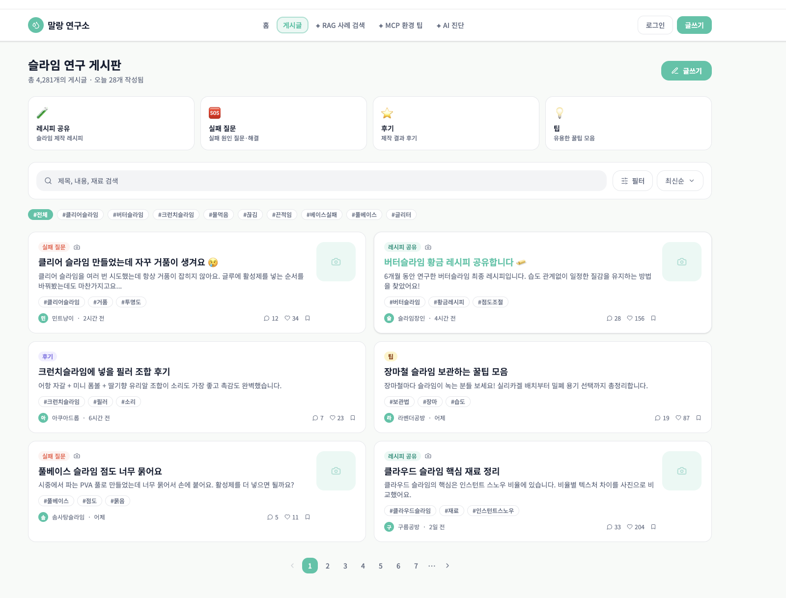
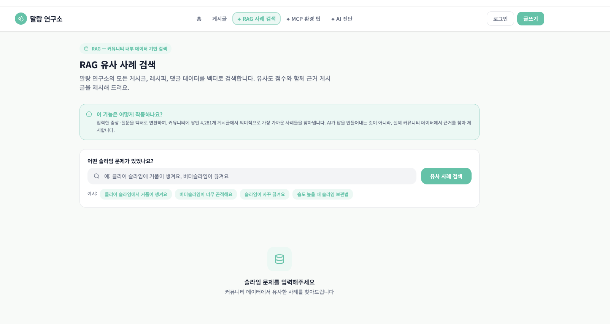
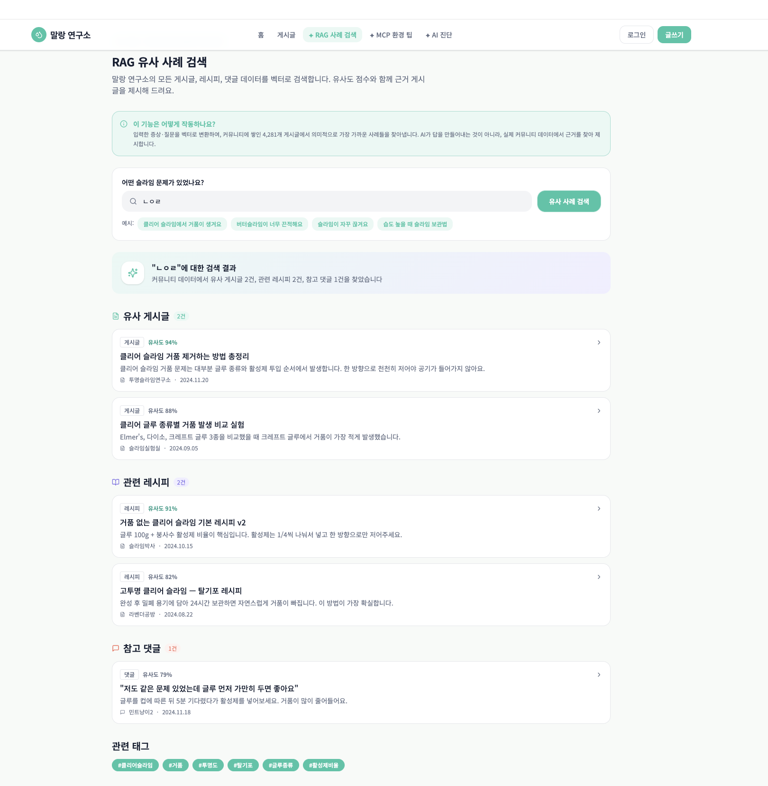
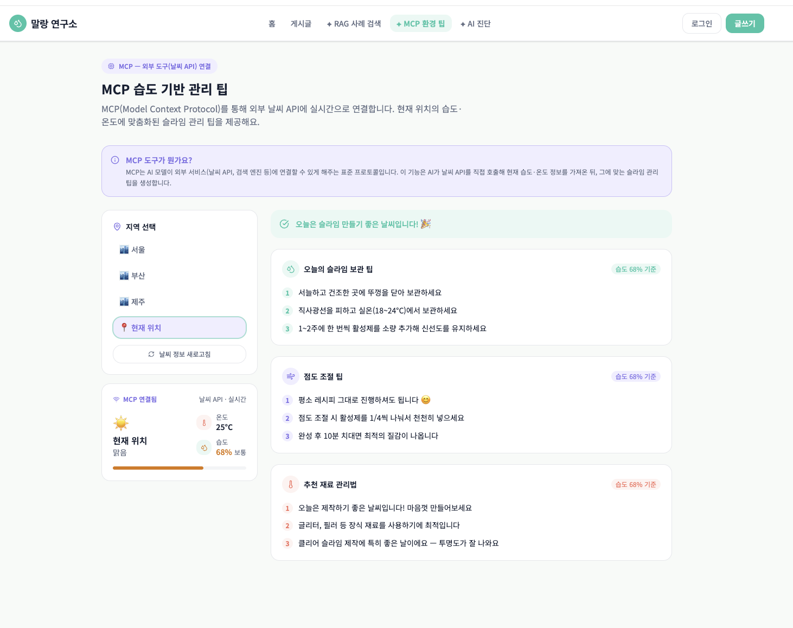
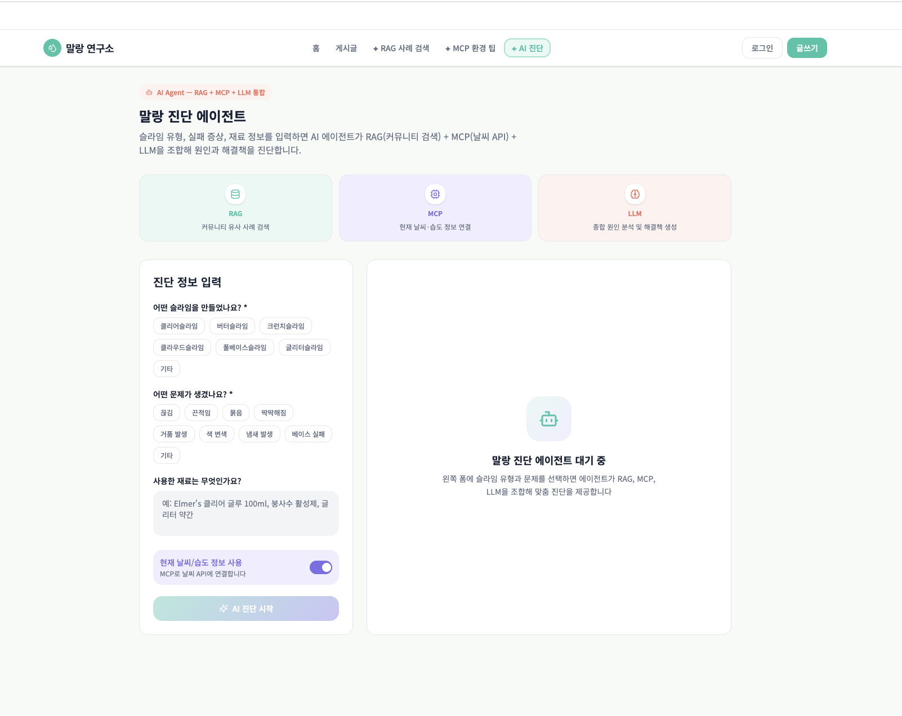
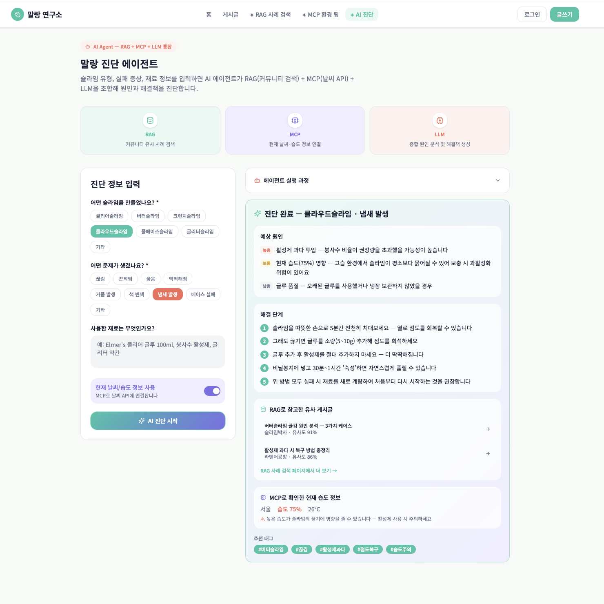

# 말랑 연구소 와이어프레임

첨부된 화면 초안을 보관한 폴더입니다. 전체 톤은 clean lab mint 방향으로 정리하며, 넓은 면은 `Background #F7FAF8`, `Surface #FFFFFF`, `Soft Mint #E9F8F4`를 중심으로 사용합니다.

## 화면 목록

### 01. 홈

검색, 인기 태그, AI 기능 카드, 최근 게시글의 전체 정보 구조를 보여줍니다.

### 02. 게시글 상세

본문, 이미지 영역, 댓글, RAG 유사 사례 사이드 패널을 확인할 수 있습니다.

### 03. 게시글 목록

카테고리, 검색/필터, 태그 칩, 게시글 카드 레이아웃 기준입니다.

### 04. RAG 검색 초기

입력 전 안내와 검색 폼 구조를 보여줍니다.

### 05. RAG 검색 결과

유사 게시글, 관련 레시피, 참고 댓글 섹션 구성 기준입니다.

### 06. MCP 습도 관리 팁

지역 선택, 현재 날씨, 습도별 관리 팁을 보여줍니다.

### 07. AI 진단 초기

진단 입력 폼과 대기 상태 패널의 구조입니다.

### 08. AI 진단 결과

RAG, MCP, Agent 결과를 통합해 보여주는 패널 기준입니다.

### 09. 로그인

인증 폼의 중앙 정렬과 입력 필드 밀도를 확인합니다.

### 10. 회원가입

로그인 화면과 동일한 인증 폼 패턴을 사용합니다.

### 11. 게시글 작성

카테고리, 점도, 태그 칩과 이미지 업로드 영역 기준입니다.

## 색상 정리 메모

인기 태그와 카테고리 칩은 기본적으로 흰 배경에 `Border #E5E7EB` 라인을 사용하고, 선택된 칩만 `Primary Mint #36C5A7` 배경으로 강조합니다.

RAG, MCP, Agent 카드는 강한 컬러 블록을 피하고 흰 카드 안에 작은 아이콘, `Primary Mint`, `Secondary Lavender`, `Coral` 배지만 제한적으로 사용합니다.
